Sharpe Ratio Comparisons
================

## R Packages

- The [fredr package](https://cran.r-project.org/package=fredr) is an R
  package that wraps the FRED API for easy importing of FRED data into
  R.
- The [quantmod package](https://cran.r-project.org/package=quantmod)
  contains tools for importing and analyzing financial data.
- The [xts package](https://cran.r-project.org/package=xts) allows for
  some additional time series functionality.
- The [reshape2 package](https://cran.r-project.org/package=reshape2) is
  used to prepare data frames for ggplot2 graphics.
- The [ggplot2 package](https://cran.r-project.org/package=ggplot2)
  includes tools for generating graphics and visuals.
- The [rmarkdown package](https://cran.r-project.org/package=rmarkdown)
  is used to generate this R Notebook.

The first three lines in this setup chunk automatically install any R
packages that you may be missing. One note regarding any code chunk
labeled ‘setup’ is that the R Notebook will automatically run it prior
to any other code chunk.

``` r
list.of.packages = c("fredr",
                     "quantmod", 
                     "xts", 
                     "reshape2", 
                     "ggplot2", 
                     "rmarkdown")
new.packages = list.of.packages[!(list.of.packages %in% installed.packages()[,"Package"])]
if(length(new.packages)) install.packages(new.packages)
library(fredr)
library(quantmod)
```

    ## Loading required package: xts

    ## Loading required package: zoo

    ## 
    ## Attaching package: 'zoo'

    ## The following objects are masked from 'package:base':
    ## 
    ##     as.Date, as.Date.numeric

    ## Loading required package: TTR

    ## Registered S3 method overwritten by 'quantmod':
    ##   method            from
    ##   as.zoo.data.frame zoo

``` r
library(xts)
library(reshape2)
library(ggplot2)
```

Set the width of the output boxes to be a bit wider than usual. \*This
will help when outputting matrices.\*

``` r
options(width=120)
```

## FRED Data Import

To access the FRED API, you must first create an account and [request an
API key](https://fred.stlouisfed.org/docs/api/api_key.html). If you wish
to run the code and replicate the results, you’ll need to make an
account, generate your own API key, and run this command un-commented
with your key in place of the placeholder text.

``` r
#fredr_set_key("<YOUR-FRED-API-KEY>")
```

Using the `fredr()` function, we will import the 10-year Treasury note
yields. This is a typical proxy for the risk-free return when applying
CAPM and calculating stock betas. The Sys.Date function is simply using
the computer’s current time to get the most up-to-date data. *We could
also import BTC prices via FRED, but they only use data from one
exchange, whereas CoinMarketCap averages across many.*

``` r
RFraw = fredr(
  series_id = "DGS10",
  observation_start = as.Date("2011-04-30"),
  observation_end = as.Date(Sys.Date()),
  frequency = "m"
)
INFraw = fredr(
  series_id = "CPIAUCSL",
  observation_start = as.Date("2011-04-30"),
  observation_end = as.Date(Sys.Date()),
  frequency = "m"
)
```

We will then create a `xts` time series object, `ALL`, to collect all
the asset returns. This effectively imposes the directed nature of time
into the data frame’s properties and opens the door to additional
functions from the xts package. The second line of code renames the
Treasury yields as `rf`, and the last line removes the extra variables
that are no longer needed.

``` r
ALL = xts(RFraw,order.by=RFraw$date)
colnames(ALL)[colnames(ALL)=="value"] <- "rf"
ALL = subset(ALL,select=-c(date,series_id,realtime_start,realtime_end))
```

Before we attach the inflation rate to the `ALL` table, we must first
calculate it from the CPI levels that we downloaded. This will
effectively be the same process that we will follow to convert stock
prices to annualized returns.

First, we do the same three steps as above, which creates the `CPI`
variable in the `INF` data frame. Then we calculate the monthly log
returns (growth rates) by taking the successive difference between the
natural logarithms of the CPI. Lastly, we convert the monthly inflation
numbers to annualized percentages by multiplying by 12 and 100. *There
are some more details on this below in the stock return examples.*

``` r
INF = xts(INFraw,order.by=INFraw$date)
colnames(INF)[colnames(INF)=="value"] <- "CPI"
INF = subset(INF,select=-c(date,series_id,realtime_start,realtime_end))
INF$INFmonthly = log(as.numeric(INF$CPI)) - log(as.numeric(lag(INF$CPI)))
INF$inf = INF$INFmonthly*12*100
# Attach the annualized inflation numbers to the ALL data frame
ALL = merge(ALL,INF$inf)
```

## Yahoo Finance Data Import

The quantmod package contains tools for importing both stock and crypto
data from Yahoo! Finance. The `getSymbols()` function is used to import
the data. The first argument is a vector of ticker symbols, and the
`src` argument specifies the data source. The `from` and `to` arguments
specify the date range for the data. Then the `periodicity="monthly"`
requests a monthly series, rather than the default daily frequency.

``` r
tickers = c("SPY",
            "GOOG",
            "AAPL",
            "TSLA",
            "BTC-USD",
            "ETH-USD",
            "ADA-USD")
getSymbols(tickers,
           src="yahoo",
           from="2011-04-01",
           to=Sys.Date(),
           periodicity="monthly")
```

Rename the crypto data frames since the \$ indexing doesn’t work with
the hyphen in the name. Then covert the asset price series to annualized
returns and merge these return series to the `ALL` data frame.

``` r
BTC = `BTC-USD`
ETH = `ETH-USD`
ADA = `ADA-USD`
# Compute returns
SPY$Return = c(NA, diff(log(as.numeric(SPY$SPY.Adjusted))))
GOOG$Return = c(NA, diff(log(as.numeric(GOOG$GOOG.Adjusted))))
AAPL$Return = c(NA, diff(log(as.numeric(AAPL$AAPL.Adjusted))))
TSLA$Return = c(NA, diff(log(as.numeric(TSLA$TSLA.Adjusted))))
BTC$Return = c(NA, diff(log(as.numeric(BTC$`BTC-USD.Adjusted`))))
ETH$Return = c(NA, diff(log(as.numeric(ETH$`ETH-USD.Adjusted`))))
ADA$Return = c(NA, diff(log(as.numeric(ADA$`ADA-USD.Adjusted`))))
# Annualize returns
SPY$SPY = SPY$Return*12*100
GOOG$GOOG = GOOG$Return*12*100
AAPL$AAPL = AAPL$Return*12*100
TSLA$TSLA = TSLA$Return*12*100
BTC$BTC = BTC$Return*12*100
ETH$ETH = ETH$Return*12*100
ADA$ADA = ADA$Return*12*100
# Merge to ALL
ALL = merge(ALL, 
            SPY$SPY,
            GOOG$GOOG,
            AAPL$AAPL,
            TSLA$TSLA,
            BTC$`BTC`,
            ETH$`ETH`,
            ADA$`ADA`)
```

## Prepare Final Data

Now that we have all the annualized monthly returns for all the assets,
we will subset down to the 60 most recent full month observations. The
first line takes the `tail()` of the `ALL` data frame and counts how
many of the most recent observations are incomplete using
`complete.cases()`. Then the second line creates our `FINAL` data frame
where we trim off those extra, incomplete observations. Then the final
line trims off anything earlier than the most recent 60 months. Thus, we
end with a data frame with the 60 most recent monthly observations where
we have all data present (except for ADA, which doesn’t yet have a full
60 months of historical return data). This is the typical kind of data
for CAPM calculations; however, there are certainly many extensions and
expansions in the vast asset pricing literature.

``` r
ntrim = sum(!complete.cases(tail(ALL)))
FINAL = ALL[1:(nrow(ALL)-ntrim),]
FINAL = last(FINAL,60)
```

Then before we dive into analyzing our final dataset, let’s create a
couple portfolios between the S&P 500 and Bitcoin. For Portfolio 1,
we’ll do an equal-weight portfolio between the S&P 500 and Bitcoin. Then
Portfolio 2 will be 95% S&P 500 and 5% Bitcoin.

``` r
w = c(0.5,0.5)
FINAL$PORT5050 = w[1]*FINAL$SPY+w[2]*FINAL$BTC
w = c(0.95,0.05)
FINAL$PORT9505 = w[1]*FINAL$SPY+w[2]*FINAL$BTC
```

## Examine the Returns Series

### Visualize the Data

We will use the ggplot2 package for graphics. To start, let’s plot out a
bar chart for the least volatile return series, the risk-free rate
(10-year Treasury yield). For this plot, we load in our final data
frame, set the x input as `Index` (which is the index for our xts
object, *time*). Then we plot the risk-free return on the y-axis. The
`geom_col()` line indicates the type of plot, and the title is set with
`ggtitle()`. The `xlab()` function is used to remove the x-axis label
since it is not needed here.

``` r
ggplot(FINAL,aes(x=Index,y=rf))+
  geom_col()+
  xlab("")+
  ggtitle("Risk-Free Asset Returns (10-Year Treasury Yield)")
```

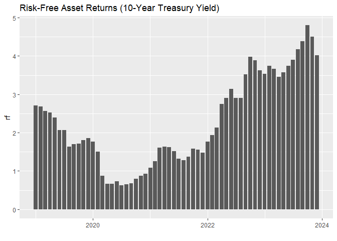<!-- -->

Then we’ll generate the same chart for the inflation rates and asset
returns.

``` r
ggplot(FINAL,aes(x=Index,y=inf))+
  geom_col()+
  xlab("")+
  ggtitle("Annualized Inflation Rates")
```

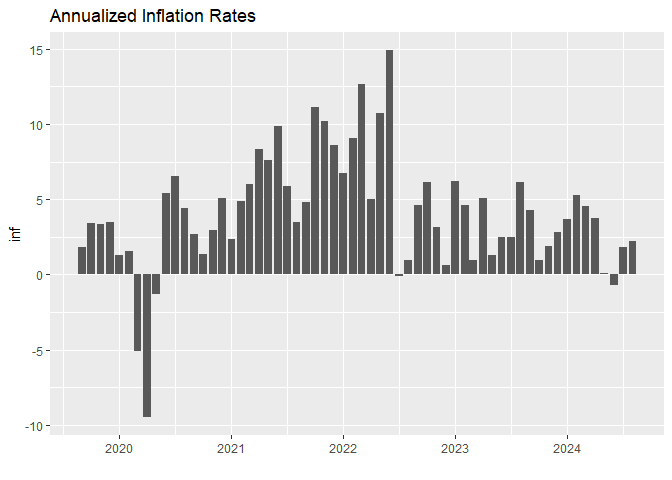<!-- -->

``` r
ggplot(FINAL,aes(x=Index,y=SPY))+
  geom_col()+
  xlab("")+
  ggtitle("SPY Returns")
```

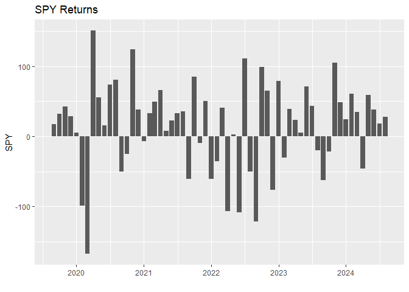<!-- -->

``` r
ggplot(FINAL,aes(x=Index,y=GOOG))+
  geom_col()+
  xlab("")+
  ggtitle("GOOG Returns")
```

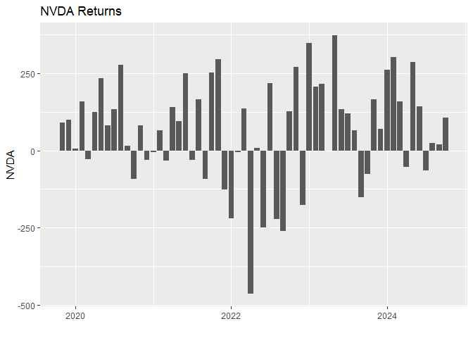<!-- -->

``` r
ggplot(FINAL,aes(x=Index,y=AAPL))+
  geom_col()+
  xlab("")+
  ggtitle("AAPL Returns")
```

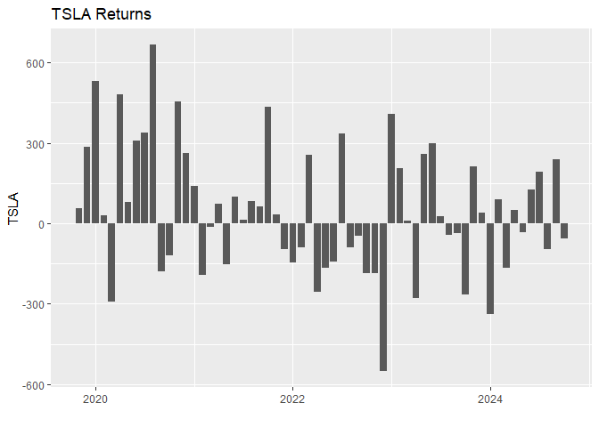<!-- -->

``` r
ggplot(FINAL,aes(x=Index,y=TSLA))+
  geom_col()+
  xlab("")+
  ggtitle("TSLA Returns")
```

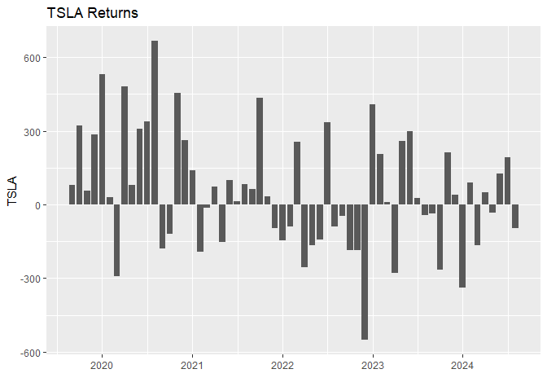<!-- -->

``` r
ggplot(FINAL,aes(x=Index,y=BTC))+
  geom_col()+
  xlab("")+
  ggtitle("BTC Returns")
```

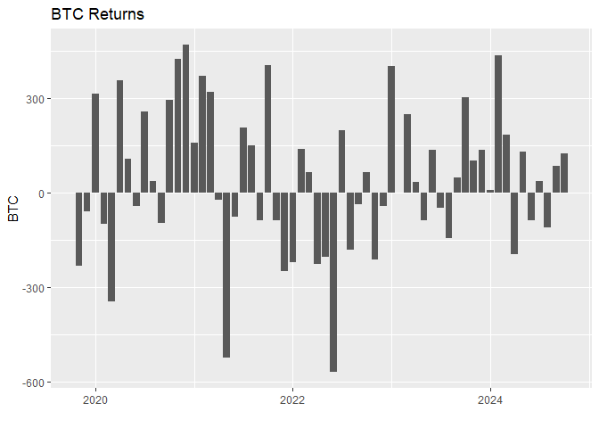<!-- -->

``` r
ggplot(FINAL,aes(x=Index,y=ETH))+
  geom_col()+
  xlab("")+
  ggtitle("ETH Returns")
```

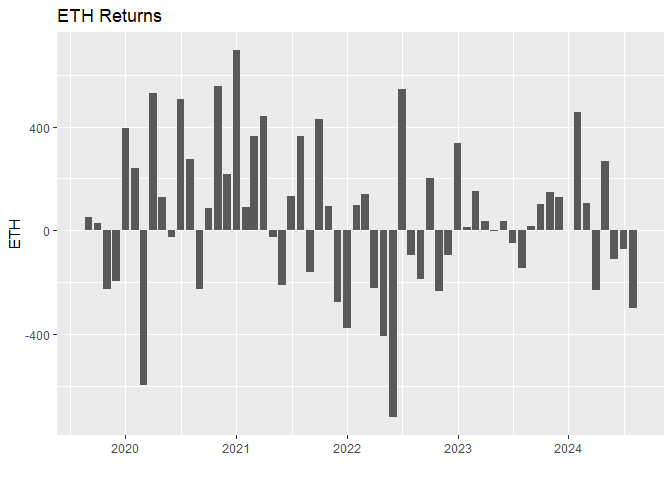<!-- -->

``` r
ggplot(FINAL,aes(x=Index,y=ADA))+
  geom_col()+
  xlab("")+
  ggtitle("ADA Returns")
```

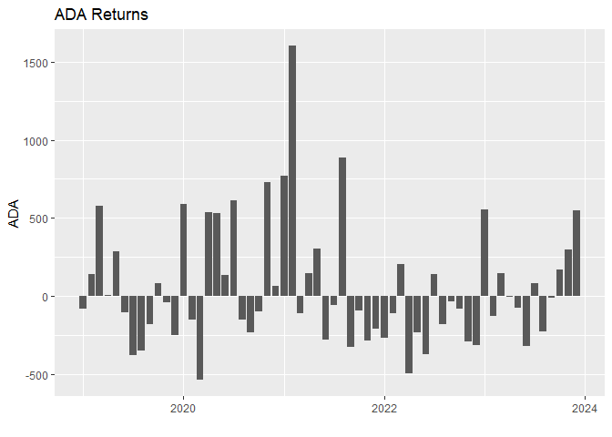<!-- -->

``` r
ggplot(FINAL,aes(x=Index,y=PORT5050))+
  geom_col()+
  xlab("")+
  ggtitle("Portfolio 1 Returns (50% S&P 500, 50% BTC)")
```

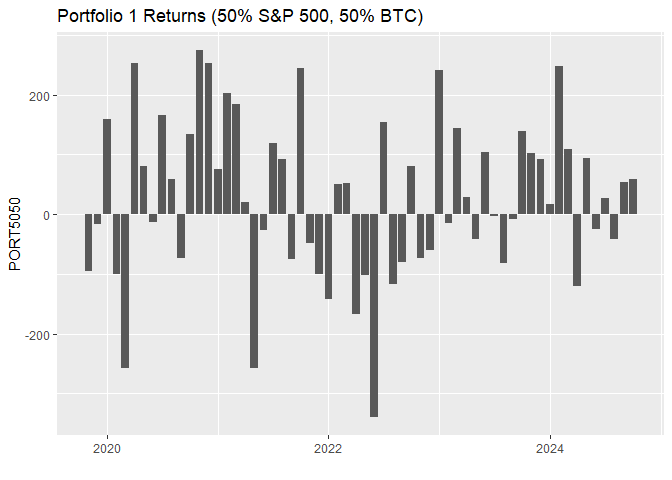<!-- -->

``` r
ggplot(FINAL,aes(x=Index,y=PORT9505))+
  geom_col()+
  xlab("")+
  ggtitle("Portfolio 2 Returns (95% S&P 500, 5% BTC)")
```

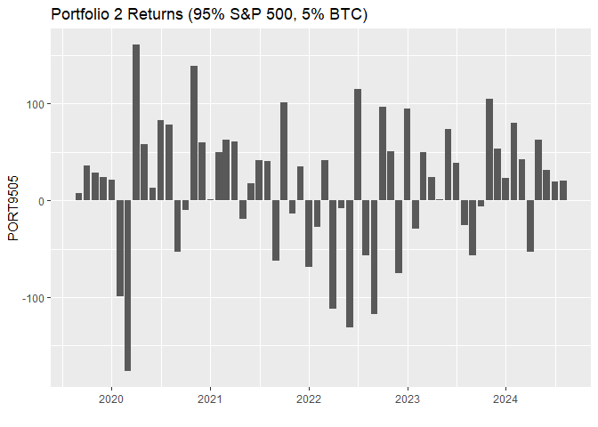<!-- -->

### The Multivariate Return Distribution

Now let’s go beyond just visualizing the individual return series and
look at some statistics for the multivariate return distribution. If we
consider a multivariate normal distribution, we can think of the mean
vector as the expected returns for each asset, and the covariance matrix
as the variance of each asset’s returns along the diagonal, and the
covariances between each pair of assets in the off-diagonal elements.

The `colMeans()` function calculates the average of each column
(i.e. the average return for each asset).*Note: the `round()` function
is applied to reduce the number of decimals when displaying the
calculations in the output.*

``` r
Er = colMeans(FINAL,na.rm=TRUE)
Er |> round(digits=2)
```

    ##       rf      inf      SPY     GOOG     AAPL     TSLA      BTC      ETH      ADA PORT5050 PORT9505 
    ##     2.53     4.09    14.70    20.47    30.29    53.11    36.24    53.58    40.76    25.47    15.78

Now let’s calculate the volatility (standard deviation of returns) for
each of these assets. This is done by simply calculating the standard
deviation `sd()` of each return series (reduced to just one line of code
using the `apply()` function).

``` r
sigma = apply(FINAL,2,sd,na.rm=TRUE)
sigma |> round(digits=2)
```

    ##       rf      inf      SPY     GOOG     AAPL     TSLA      BTC      ETH      ADA PORT5050 PORT9505 
    ##     1.36     3.97    63.54    92.81    99.46   239.85   230.02   286.95   385.65   134.88    67.29

Then beyond the individual asset volatilities, another critical
component of portfolio-level risk is the correlations across the
individual assets. The starting point for this is the covariance matrix,
which we can compute using the `cov()` function. *Note: the
`use="pairwise.complete.obs"` parameter prevents missing values in the
event that any of the assets have less than 60 months of data available.
This is no longer necessary; however, that was not the case back when I
started this.*

``` r
cov(FINAL, use="pairwise.complete.obs") |> round(digits=0)
```

    ##            rf  inf   SPY  GOOG  AAPL  TSLA   BTC   ETH    ADA PORT5050 PORT9505
    ## rf          2    0    -2   -11   -22   -97   -27   -77   -118      -15       -4
    ## inf         0   16   -19   -22   -41   -64  -176  -197   -217      -97      -27
    ## SPY        -2  -19  4038  4288  4805  8233  7912 11251  11242     5975     4232
    ## GOOG      -11  -22  4288  8613  5056 10628  9373 13774  17381     6830     4542
    ## AAPL      -22  -41  4805  5056  9892 16876  8076 12919   8318     6440     4968
    ## TSLA      -97  -64  8233 10628 16876 57527 23963 36879  29287    16098     9019
    ## BTC       -27 -176  7912  9373  8076 23963 52908 51528  51727    30410    10162
    ## ETH       -77 -197 11251 13774 12919 36879 51528 82339  69226    31390    13265
    ## ADA      -118 -217 11242 17381  8318 29287 51727 69226 148729    31484    13266
    ## PORT5050  -15  -97  5975  6830  6440 16098 30410 31390  31484    18193     7197
    ## PORT9505   -4  -27  4232  4542  4968  9019 10162 13265  13266     7197     4528

The covariance matrix above captures not just the degree of variation in
each asset return series, but also the degree to which each pair
co-moves with each other. This is often normalized by individual asset
volatilities to give a correlation matrix:

``` r
Rho = cor(FINAL,use="pairwise.complete.obs")
Rho |> round(digits=2)
```

    ##             rf   inf   SPY  GOOG  AAPL  TSLA   BTC   ETH   ADA PORT5050 PORT9505
    ## rf        1.00 -0.05 -0.03 -0.09 -0.17 -0.30 -0.09 -0.20 -0.23    -0.08    -0.04
    ## inf      -0.05  1.00 -0.08 -0.06 -0.10 -0.07 -0.19 -0.17 -0.14    -0.18    -0.10
    ## SPY      -0.03 -0.08  1.00  0.73  0.76  0.54  0.54  0.62  0.46     0.70     0.99
    ## GOOG     -0.09 -0.06  0.73  1.00  0.55  0.48  0.44  0.52  0.49     0.55     0.73
    ## AAPL     -0.17 -0.10  0.76  0.55  1.00  0.71  0.35  0.45  0.22     0.48     0.74
    ## TSLA     -0.30 -0.07  0.54  0.48  0.71  1.00  0.43  0.54  0.32     0.50     0.56
    ## BTC      -0.09 -0.19  0.54  0.44  0.35  0.43  1.00  0.78  0.58     0.98     0.66
    ## ETH      -0.20 -0.17  0.62  0.52  0.45  0.54  0.78  1.00  0.63     0.81     0.69
    ## ADA      -0.23 -0.14  0.46  0.49  0.22  0.32  0.58  0.63  1.00     0.61     0.51
    ## PORT5050 -0.08 -0.18  0.70  0.55  0.48  0.50  0.98  0.81  0.61     1.00     0.79
    ## PORT9505 -0.04 -0.10  0.99  0.73  0.74  0.56  0.66  0.69  0.51     0.79     1.00

### Real Returns

Before we start calculating Sharpe ratios and betas, we first should
adjust our asset returns for inflation to convert from ‘nominal’ returns
to ‘real’ returns.

``` r
REAL = xts(order.by=index(FINAL))
REAL$rf = (FINAL$rf-FINAL$inf)/(1+(FINAL$inf/100))
REAL$SPY = (FINAL$SPY-FINAL$inf)/(1+(FINAL$inf/100))
REAL$GOOG = (FINAL$GOOG-FINAL$inf)/(1+(FINAL$inf/100))
REAL$AAPL = (FINAL$AAPL-FINAL$inf)/(1+(FINAL$inf/100))
REAL$TSLA = (FINAL$TSLA-FINAL$inf)/(1+(FINAL$inf/100))
REAL$BTC = (FINAL$BTC-FINAL$inf)/(1+(FINAL$inf/100))
REAL$ETH = (FINAL$ETH-FINAL$inf)/(1+(FINAL$inf/100))
REAL$ADA = (FINAL$ADA-FINAL$inf)/(1+(FINAL$inf/100))
REAL$PORT5050 = (FINAL$PORT5050-FINAL$inf)/(1+(FINAL$inf/100))
REAL$PORT9505 = (FINAL$PORT9505-FINAL$inf)/(1+(FINAL$inf/100))
```

If we examine the same summary statistics for the real returns, we can
see that the risk-free rate is actually negative due to high inflation.
Then the rest of the results are qualitatively similar to before with
just minor changes to some numbers due to the inflation adjustment.

``` r
RealEr = colMeans(REAL,na.rm=TRUE)
RealEr |> round(digits=2)
```

    ##       rf      SPY     GOOG     AAPL     TSLA      BTC      ETH      ADA PORT5050 PORT9505 
    ##    -1.35    10.53    16.12    25.75    47.97    32.62    49.51    37.39    21.58    11.64

``` r
Realsigma = apply(REAL,2,sd,na.rm=TRUE)
Realsigma |> round(digits=2)
```

    ##       rf      SPY     GOOG     AAPL     TSLA      BTC      ETH      ADA PORT5050 PORT9505 
    ##     4.05    62.91    91.03    96.99   233.93   220.26   277.17   373.66   130.26    66.52

``` r
RealRho = cor(REAL,use="pairwise.complete.obs")
RealRho |> round(digits=2)
```

    ##            rf  SPY GOOG AAPL TSLA  BTC  ETH  ADA PORT5050 PORT9505
    ## rf       1.00 0.13 0.09 0.11 0.01 0.16 0.11 0.07     0.17     0.15
    ## SPY      0.13 1.00 0.74 0.77 0.56 0.56 0.63 0.48     0.71     0.99
    ## GOOG     0.09 0.74 1.00 0.56 0.49 0.46 0.53 0.50     0.57     0.74
    ## AAPL     0.11 0.77 0.56 1.00 0.71 0.37 0.47 0.24     0.50     0.75
    ## TSLA     0.01 0.56 0.49 0.71 1.00 0.44 0.55 0.33     0.51     0.57
    ## BTC      0.16 0.56 0.46 0.37 0.44 1.00 0.78 0.60     0.98     0.66
    ## ETH      0.11 0.63 0.53 0.47 0.55 0.78 1.00 0.64     0.81     0.70
    ## ADA      0.07 0.48 0.50 0.24 0.33 0.60 0.64 1.00     0.62     0.53
    ## PORT5050 0.17 0.71 0.57 0.50 0.51 0.98 0.81 0.62     1.00     0.80
    ## PORT9505 0.15 0.99 0.74 0.75 0.57 0.66 0.70 0.53     0.80     1.00

### Excess Returns

The last step before we calculate the Sharpe ratios is converting the
real asset returns into ‘excess returns’. This involves subtracting the
risk-free returns from each asset’s return series. Since our average
real risk-free return was negative, this actually increases the expected
returns. One way to think about what this does is that the theoretical
risk-free asset should have zero variance. Since our T-bill risk-free
asset does not have a zero variance, this adjustment normalizes the
scenario to where the ‘excess return adjustment’ (subtracting rf) would
force the risk-free returns to have zero variance, and thus be more
appropriate for modeling. Interestingly, even after the inflation and
risk-free adjustments, Cardano’s ADA is still more highly correlated
with Alphabet’s stock, than it is with its primary smart contract
competitor, ETH.

``` r
XS = xts(order.by=index(FINAL))
XS$SPY = REAL$SPY-REAL$rf
XS$GOOG = REAL$GOOG-REAL$rf
XS$AAPL = REAL$AAPL-REAL$rf
XS$TSLA = REAL$TSLA-REAL$rf
XS$BTC = REAL$BTC-REAL$rf
XS$ETH = REAL$ETH-REAL$rf
XS$ADA = REAL$ADA-REAL$rf
XS$PORT5050 = REAL$PORT5050-REAL$rf
XS$PORT9505 = REAL$PORT9505-REAL$rf
```

``` r
xsEr = colMeans(XS,na.rm=TRUE)
xsEr |> round(digits=2)
```

    ##      SPY     GOOG     AAPL     TSLA      BTC      ETH      ADA PORT5050 PORT9505 
    ##    11.89    17.47    27.10    49.32    33.98    50.86    38.74    22.93    12.99

``` r
xssigma = apply(XS,2,sd,na.rm=TRUE)
xssigma |> round(digits=2)
```

    ##      SPY     GOOG     AAPL     TSLA      BTC      ETH      ADA PORT5050 PORT9505 
    ##    62.50    90.77    96.64   233.94   219.63   276.75   373.40   129.63    66.05

``` r
xsRho = cor(XS,use="pairwise.complete.obs")
xsRho |> round(digits=2)
```

    ##           SPY GOOG AAPL TSLA  BTC  ETH  ADA PORT5050 PORT9505
    ## SPY      1.00 0.74 0.77 0.56 0.55 0.63 0.47     0.71     0.99
    ## GOOG     0.74 1.00 0.56 0.49 0.45 0.53 0.50     0.56     0.74
    ## AAPL     0.77 0.56 1.00 0.72 0.36 0.46 0.23     0.49     0.75
    ## TSLA     0.56 0.49 0.72 1.00 0.44 0.55 0.33     0.51     0.58
    ## BTC      0.55 0.45 0.36 0.44 1.00 0.78 0.60     0.98     0.66
    ## ETH      0.63 0.53 0.46 0.55 0.78 1.00 0.64     0.81     0.69
    ## ADA      0.47 0.50 0.23 0.33 0.60 0.64 1.00     0.62     0.53
    ## PORT5050 0.71 0.56 0.49 0.51 0.98 0.81 0.62     1.00     0.80
    ## PORT9505 0.99 0.74 0.75 0.58 0.66 0.69 0.53     0.80     1.00

## Sharpe Ratios

The Sharpe ratio compares the ratio of the excess return of portfolio
with its volatility. For simplicity, we will calculate this for
portfolios invested 100% in each individual asset, followed by the two
portfolios that we constructed.

The formula: $Sharpe$ $Ratio = \dfrac{R_p-R_f}{\sigma_p}$ divides the
excess return by the standard deviation of the excess returns.

``` r
Sharpes_5yr = xsEr/xssigma
Sharpes_5yr |> round(digits=2)
```

    ##      SPY     GOOG     AAPL     TSLA      BTC      ETH      ADA PORT5050 PORT9505 
    ##     0.19     0.19     0.28     0.21     0.15     0.18     0.10     0.18     0.20

## Betas

Another important distinction that is often made in finance is
decomposing risk (volatility) into systematic piece and an idiosyncratic
piece. In the Capital Asset Pricing Model, systematic risk is
effectively the portion of an asset/portfolio’s return that can be
explained by a single market factor. This concept has branched off a
vast literature on asset pricing, which includes multifactor models. We
will stick with the single-factor CAPM where the S&P 500 returns are a
fairly typical measure of broader market movements.

$r_i - r_f = \alpha + \beta*(r_m - r_f) +\epsilon$

In the above equation, $r_i$ is the real excess return for company $i$,
$r_f$ is the real risk-free rate, and $r_m$ is the real market return.
We then use our data to estimate $\alpha$ and $\beta$, and then our
model errors are represented by $\epsilon$.

To fit the CAPM relationship, we estimate a linear regression of the
GOOG excess returns on the market (S&P500) excess returns. The summary
function prints the regression estimates/results, and then ggplot lets
us easily plot the relationship. For GOOG, we get a beta estimate
reasonably close to 1, which suggests that Alphabet has roughly an equal
level of systematic risk as the market as a whole (or at least as
measured by the S&P 500). Thus, the interpretation is that if the market
goes up or down by 1%, we would expect that GOOG would also increase or
decrease by the same amount (percentage-wise).

Then let’s make note of the strength of the fit with the $R^2>0.5$.
Theoretically, this would indicate the percent of variation in GOOG that
is explained by broader market movements, but since GOOG is a major
component of the S&P 500, that might not be the best interpretation for
this particular example. In other words, it shouldn’t be surprising that
the beta for GOOG is close to 1.

The last bit of info that we will make note of from these results is the
`(Intercept)` coefficient. In CAPM, this estimate of ‘alpha’ represents
the average annual outperformance of the asset over the market. Thus,
GOOG has outperformed the market on average over the past 5 years.

``` r
GOOGfit = lm(GOOG~SPY,data=XS)
summary(GOOGfit)
```

    ## 
    ## Call:
    ## lm(formula = GOOG ~ SPY, data = XS)
    ## 
    ## Residuals:
    ##      Min       1Q   Median       3Q      Max 
    ## -121.502  -36.893   -0.321   32.373  144.817 
    ## 
    ## Coefficients:
    ##             Estimate Std. Error t value Pr(>|t|)    
    ## (Intercept)   4.7767     8.1517   0.586     0.56    
    ## SPY           1.0683     0.1292   8.271 2.16e-11 ***
    ## ---
    ## Signif. codes:  0 '***' 0.001 '**' 0.01 '*' 0.05 '.' 0.1 ' ' 1
    ## 
    ## Residual standard error: 62.01 on 58 degrees of freedom
    ## Multiple R-squared:  0.5412, Adjusted R-squared:  0.5333 
    ## F-statistic: 68.41 on 1 and 58 DF,  p-value: 2.156e-11

``` r
ggplot(XS,aes(x=SPY,y=GOOG))+
  geom_point()+
  geom_smooth(method="lm")
```

    ## `geom_smooth()` using formula = 'y ~ x'

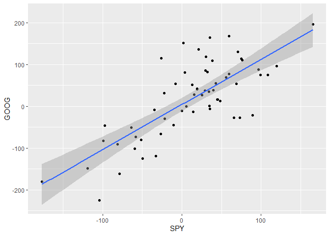<!-- -->

Now with Apple, we get a slightly larger beta, which suggests that a 1%
increase in the market is expected to correspond with an amplified
increase in the price of AAPL. Similarly, a 1% decline in the market
would be expected to correlate with a larger decrease in the price of
AAPL. Along with this larger systematic risk, the alpha estimate shows
that AAPL has compensated for this higher risk with a higher average
return over the market.

``` r
AAPLfit = lm(AAPL~SPY,data=XS)
summary(AAPLfit)
```

    ## 
    ## Call:
    ## lm(formula = AAPL ~ SPY, data = XS)
    ## 
    ## Residuals:
    ##      Min       1Q   Median       3Q      Max 
    ## -146.779  -44.542    1.072   44.196  128.909 
    ## 
    ## Coefficients:
    ##             Estimate Std. Error t value Pr(>|t|)    
    ## (Intercept)  13.0104     8.2213   1.583    0.119    
    ## SPY           1.1859     0.1303   9.103 8.96e-13 ***
    ## ---
    ## Signif. codes:  0 '***' 0.001 '**' 0.01 '*' 0.05 '.' 0.1 ' ' 1
    ## 
    ## Residual standard error: 62.54 on 58 degrees of freedom
    ## Multiple R-squared:  0.5883, Adjusted R-squared:  0.5812 
    ## F-statistic: 82.87 on 1 and 58 DF,  p-value: 8.964e-13

``` r
ggplot(XS,aes(x=SPY,y=AAPL))+
  geom_point()+
  geom_smooth(method="lm")
```

    ## `geom_smooth()` using formula = 'y ~ x'

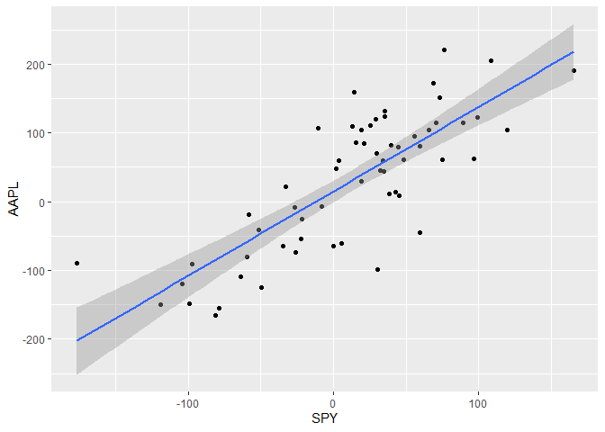<!-- -->

With Tesla, we see there is a much larger beta estimate. This also
corresponds with a larger alpha suggesting this increased systematic
risk has been compensated well. However, the strength of this
relationship is weaker than the previous two examples. Although Tesla is
still a fairly recent addition to the S&P 500 (late-2020), it has
quickly jumped into one of the top 10 spots in terms of market
capitalization (and thus, weight in the index). However, it remains
smaller than both Alphabet and Apple, so the weaker relationship is not
surprising.

``` r
TSLAfit = lm(TSLA~SPY,data=XS)
summary(TSLAfit)
```

    ## 
    ## Call:
    ## lm(formula = TSLA ~ SPY, data = XS)
    ## 
    ## Residuals:
    ##     Min      1Q  Median      3Q     Max 
    ## -406.94  -92.54  -11.17  148.12  489.48 
    ## 
    ## Coefficients:
    ##             Estimate Std. Error t value Pr(>|t|)    
    ## (Intercept)  24.4664    25.7241   0.951    0.345    
    ## SPY           2.0911     0.4076   5.130  3.5e-06 ***
    ## ---
    ## Signif. codes:  0 '***' 0.001 '**' 0.01 '*' 0.05 '.' 0.1 ' ' 1
    ## 
    ## Residual standard error: 195.7 on 58 degrees of freedom
    ## Multiple R-squared:  0.3121, Adjusted R-squared:  0.3003 
    ## F-statistic: 26.32 on 1 and 58 DF,  p-value: 3.501e-06

``` r
ggplot(XS,aes(x=SPY,y=TSLA))+
  geom_point()+
  geom_smooth(method="lm")
```

    ## `geom_smooth()` using formula = 'y ~ x'

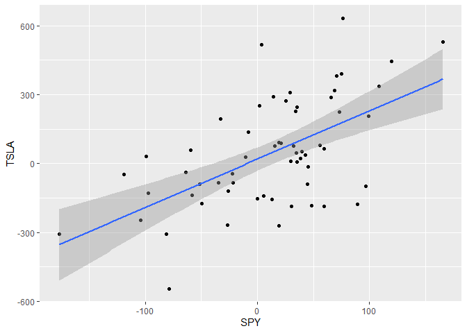<!-- -->

Similarly, we can calculate the beta for our other assets and
portfolios.

``` r
BTCfit = lm(BTC~SPY,data=XS)
summary(BTCfit)
```

    ## 
    ## Call:
    ## lm(formula = BTC ~ SPY, data = XS)
    ## 
    ## Residuals:
    ##     Min      1Q  Median      3Q     Max 
    ## -510.15 -112.21  -10.27  132.46  364.91 
    ## 
    ## Coefficients:
    ##             Estimate Std. Error t value Pr(>|t|)    
    ## (Intercept)  11.0497    24.3391   0.454    0.652    
    ## SPY           1.9290     0.3857   5.002 5.58e-06 ***
    ## ---
    ## Signif. codes:  0 '***' 0.001 '**' 0.01 '*' 0.05 '.' 0.1 ' ' 1
    ## 
    ## Residual standard error: 185.2 on 58 degrees of freedom
    ## Multiple R-squared:  0.3014, Adjusted R-squared:  0.2893 
    ## F-statistic: 25.02 on 1 and 58 DF,  p-value: 5.583e-06

``` r
ggplot(XS,aes(y=BTC,x=SPY))+
  geom_point()+
  geom_smooth(method="lm")
```

    ## `geom_smooth()` using formula = 'y ~ x'

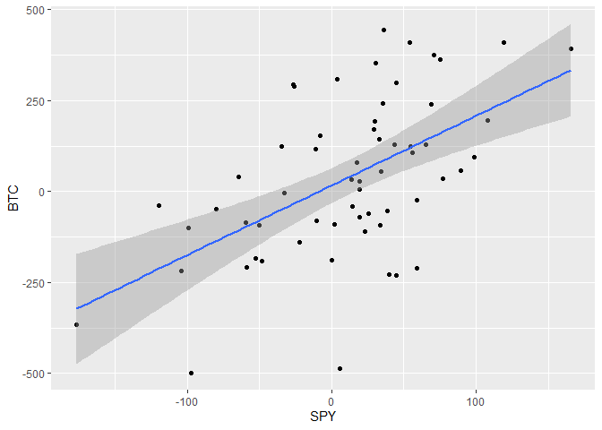<!-- -->

``` r
ETHfit = lm(ETH~SPY,data=XS)
summary(ETHfit)
```

    ## 
    ## Call:
    ## lm(formula = ETH ~ SPY, data = XS)
    ## 
    ## Residuals:
    ##     Min      1Q  Median      3Q     Max 
    ## -411.35 -114.84   -5.19  132.18  681.11 
    ## 
    ## Coefficients:
    ##             Estimate Std. Error t value Pr(>|t|)    
    ## (Intercept)  17.8471    28.5734   0.625    0.535    
    ## SPY           2.7777     0.4528   6.135 8.15e-08 ***
    ## ---
    ## Signif. codes:  0 '***' 0.001 '**' 0.01 '*' 0.05 '.' 0.1 ' ' 1
    ## 
    ## Residual standard error: 217.4 on 58 degrees of freedom
    ## Multiple R-squared:  0.3936, Adjusted R-squared:  0.3831 
    ## F-statistic: 37.64 on 1 and 58 DF,  p-value: 8.15e-08

``` r
ggplot(XS,aes(y=ETH,x=SPY))+
  geom_point()+
  geom_smooth(method="lm")
```

    ## `geom_smooth()` using formula = 'y ~ x'

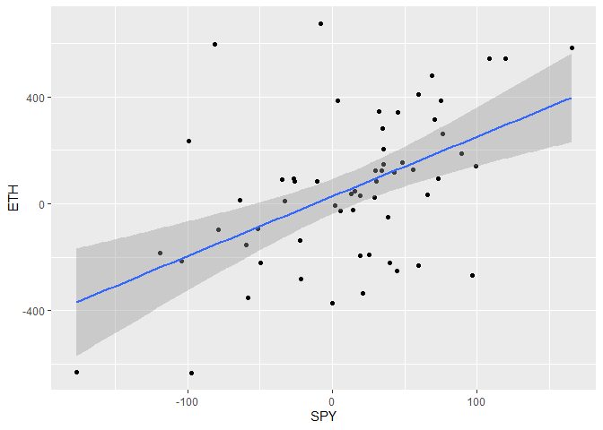<!-- -->

``` r
ADAfit = lm(ADA~SPY,data=XS)
summary(ADAfit)
```

    ## 
    ## Call:
    ## lm(formula = ADA ~ SPY, data = XS)
    ## 
    ## Residuals:
    ##     Min      1Q  Median      3Q     Max 
    ## -505.85 -213.88  -60.74  121.43 1433.68 
    ## 
    ## Coefficients:
    ##             Estimate Std. Error t value Pr(>|t|)    
    ## (Intercept)   5.0183    43.5657   0.115 0.908693    
    ## SPY           2.8372     0.6903   4.110 0.000126 ***
    ## ---
    ## Signif. codes:  0 '***' 0.001 '**' 0.01 '*' 0.05 '.' 0.1 ' ' 1
    ## 
    ## Residual standard error: 331.4 on 58 degrees of freedom
    ## Multiple R-squared:  0.2256, Adjusted R-squared:  0.2122 
    ## F-statistic: 16.89 on 1 and 58 DF,  p-value: 0.000126

``` r
ggplot(XS,aes(y=ADA,x=SPY))+
  geom_point()+
  geom_smooth(method="lm")
```

    ## `geom_smooth()` using formula = 'y ~ x'

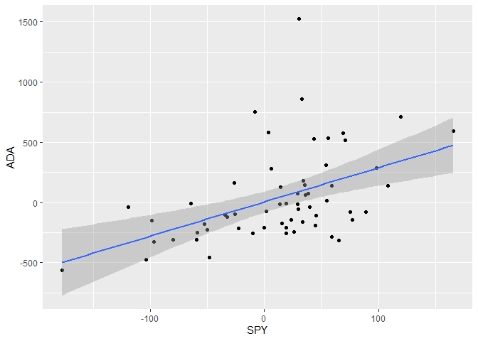<!-- -->

Now let’s check out the portfolios. Since the S&P 500 is one of the two
weights, the beta will transition from bitcoin’s beta at $w_{BTC}=1$ to
a beta of 1 at $w_{BTC}=0$.

``` r
PORT5050fit = lm(PORT5050~SPY,data=XS)
summary(PORT5050fit)
```

    ## 
    ## Call:
    ## lm(formula = PORT5050 ~ SPY, data = XS)
    ## 
    ## Residuals:
    ##      Min       1Q   Median       3Q      Max 
    ## -255.075  -56.103   -5.136   66.231  182.454 
    ## 
    ## Coefficients:
    ##             Estimate Std. Error t value Pr(>|t|)    
    ## (Intercept)   5.5249    12.1695   0.454    0.652    
    ## SPY           1.4645     0.1928   7.595 2.93e-10 ***
    ## ---
    ## Signif. codes:  0 '***' 0.001 '**' 0.01 '*' 0.05 '.' 0.1 ' ' 1
    ## 
    ## Residual standard error: 92.58 on 58 degrees of freedom
    ## Multiple R-squared:  0.4986, Adjusted R-squared:   0.49 
    ## F-statistic: 57.68 on 1 and 58 DF,  p-value: 2.934e-10

``` r
ggplot(XS,aes(y=PORT5050,x=SPY))+
  geom_point()+
  geom_smooth(method="lm")
```

    ## `geom_smooth()` using formula = 'y ~ x'

<!-- -->

``` r
PORT9505fit = lm(PORT9505~SPY,data=XS)
summary(PORT9505fit)
```

    ## 
    ## Call:
    ## lm(formula = PORT9505 ~ SPY, data = XS)
    ## 
    ## Residuals:
    ##      Min       1Q   Median       3Q      Max 
    ## -25.5075  -5.6103  -0.5136   6.6231  18.2454 
    ## 
    ## Coefficients:
    ##             Estimate Std. Error t value Pr(>|t|)    
    ## (Intercept)  0.55249    1.21695   0.454    0.652    
    ## SPY          1.04645    0.01928  54.268   <2e-16 ***
    ## ---
    ## Signif. codes:  0 '***' 0.001 '**' 0.01 '*' 0.05 '.' 0.1 ' ' 1
    ## 
    ## Residual standard error: 9.258 on 58 degrees of freedom
    ## Multiple R-squared:  0.9807, Adjusted R-squared:  0.9804 
    ## F-statistic:  2945 on 1 and 58 DF,  p-value: < 2.2e-16

``` r
ggplot(XS,aes(y=PORT9505,x=SPY))+
  geom_point()+
  geom_smooth(method="lm")
```

    ## `geom_smooth()` using formula = 'y ~ x'

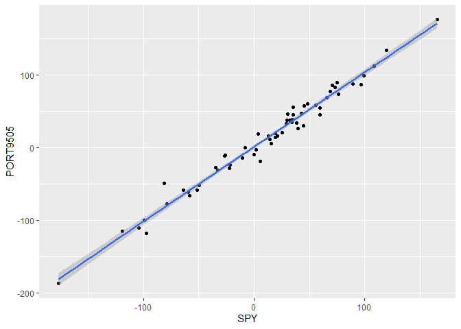<!-- -->

### Crypto-Betas

As an experiment, we can calculate the “beta” for some of the assets
using BTC as the market index, rather than the S&P 500. From this, we
can see from the $R^2$’s that the other cryptos achieve a closer fit
than they did with the S&P 500. Then the betas under 1 suggest that the
impact of BTC volatility is dampened when impacting the other cryptos.
The alphas show that after removing the volatility explained away by
BTC, both ETH and ADA generated a positive excess real return.

``` r
ETHBTCfit = lm(ETH~BTC,data=XS)
summary(ETHBTCfit)
```

    ## 
    ## Call:
    ## lm(formula = ETH ~ BTC, data = XS)
    ## 
    ## Residuals:
    ##     Min      1Q  Median      3Q     Max 
    ## -286.86 -110.39  -22.64   66.42  507.03 
    ## 
    ## Coefficients:
    ##             Estimate Std. Error t value Pr(>|t|)    
    ## (Intercept)  17.3983    22.7493   0.765    0.447    
    ## BTC           0.9849     0.1032   9.543 1.71e-13 ***
    ## ---
    ## Signif. codes:  0 '***' 0.001 '**' 0.01 '*' 0.05 '.' 0.1 ' ' 1
    ## 
    ## Residual standard error: 174.1 on 58 degrees of freedom
    ## Multiple R-squared:  0.6109, Adjusted R-squared:  0.6042 
    ## F-statistic: 91.07 on 1 and 58 DF,  p-value: 1.706e-13

``` r
ggplot(XS,aes(y=ETH,x=BTC))+
  geom_point()+
  geom_smooth(method="lm")
```

    ## `geom_smooth()` using formula = 'y ~ x'

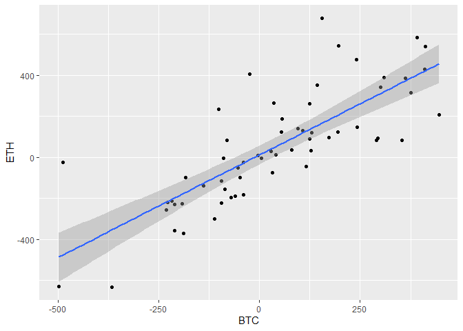<!-- -->

``` r
ADABTCfit = lm(ADA~BTC,data=XS)
summary(ADABTCfit)
```

    ## 
    ## Call:
    ## lm(formula = ADA ~ BTC, data = XS)
    ## 
    ## Residuals:
    ##     Min      1Q  Median      3Q     Max 
    ## -452.16 -185.41  -53.46  138.85 1161.79 
    ## 
    ## Coefficients:
    ##             Estimate Std. Error t value Pr(>|t|)    
    ## (Intercept)   4.2839    39.4946   0.108    0.914    
    ## BTC           1.0141     0.1792   5.660 4.92e-07 ***
    ## ---
    ## Signif. codes:  0 '***' 0.001 '**' 0.01 '*' 0.05 '.' 0.1 ' ' 1
    ## 
    ## Residual standard error: 302.3 on 58 degrees of freedom
    ## Multiple R-squared:  0.3558, Adjusted R-squared:  0.3447 
    ## F-statistic: 32.04 on 1 and 58 DF,  p-value: 4.919e-07

``` r
ggplot(XS,aes(y=ADA,x=BTC))+
  geom_point()+
  geom_smooth(method="lm")
```

    ## `geom_smooth()` using formula = 'y ~ x'

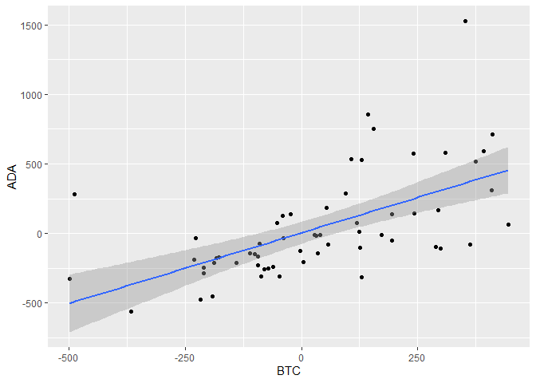<!-- -->

We can also regress the ADA excess returns on the ETH excess returns.

``` r
ADAETHfit = lm(ADA~ETH,data=XS)
summary(ADAETHfit)
```

    ## 
    ## Call:
    ## lm(formula = ADA ~ ETH, data = XS)
    ## 
    ## Residuals:
    ##     Min      1Q  Median      3Q     Max 
    ## -405.51 -180.77  -43.74  126.59 1457.52 
    ## 
    ## Coefficients:
    ##             Estimate Std. Error t value Pr(>|t|)    
    ## (Intercept)  -4.9817    38.1121  -0.131    0.896    
    ## ETH           0.8596     0.1365   6.295 4.42e-08 ***
    ## ---
    ## Signif. codes:  0 '***' 0.001 '**' 0.01 '*' 0.05 '.' 0.1 ' ' 1
    ## 
    ## Residual standard error: 290.3 on 58 degrees of freedom
    ## Multiple R-squared:  0.4059, Adjusted R-squared:  0.3957 
    ## F-statistic: 39.63 on 1 and 58 DF,  p-value: 4.42e-08

``` r
ggplot(XS,aes(y=ADA,x=ETH))+
  geom_point()+
  geom_smooth(method="lm")
```

    ## `geom_smooth()` using formula = 'y ~ x'

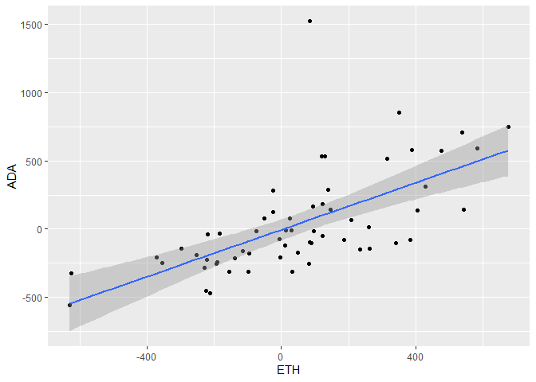<!-- -->

### Case Study: Tesla and Bitcoin

Next, we will model Tesla’s excess returns as a function of Bitcoin’s
excess returns. Since Tesla has been purchasing Bitcoin to hold on their
balance sheet, we might expect an interesting, strong result. While we
do find an interesting result, it is for the opposite reason. Both the
BTC “beta” and the regression $R^2$ are quite small.

``` r
TSLABTCfit = lm(TSLA~BTC,data=XS)
summary(TSLABTCfit)
```

    ## 
    ## Call:
    ## lm(formula = TSLA ~ BTC, data = XS)
    ## 
    ## Residuals:
    ##     Min      1Q  Median      3Q     Max 
    ## -560.48 -133.07    9.14  141.92  586.90 
    ## 
    ## Coefficients:
    ##             Estimate Std. Error t value Pr(>|t|)    
    ## (Intercept)  33.3890    27.6821   1.206 0.232654    
    ## BTC           0.4689     0.1256   3.734 0.000432 ***
    ## ---
    ## Signif. codes:  0 '***' 0.001 '**' 0.01 '*' 0.05 '.' 0.1 ' ' 1
    ## 
    ## Residual standard error: 211.9 on 58 degrees of freedom
    ## Multiple R-squared:  0.1938, Adjusted R-squared:  0.1799 
    ## F-statistic: 13.94 on 1 and 58 DF,  p-value: 0.0004324

``` r
ggplot(XS,aes(y=TSLA,x=BTC))+
  geom_point()+
  geom_smooth(method="lm")
```

    ## `geom_smooth()` using formula = 'y ~ x'

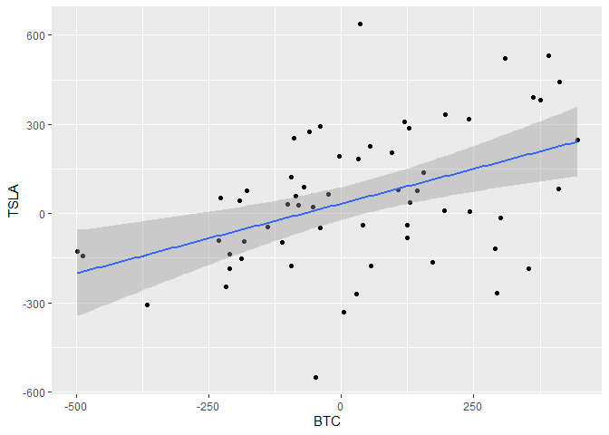<!-- -->

From the Tesla 10-K Filing for the Year Ended 12/31/2020:

“In January 2021, we updated our investment policy…including digital
assets…Thereafter, we invested an aggregate \$1.50 billion in bitcoin
under this policy and may acquire and hold digital assets from time to
time or long-term.”

*Note: During Q2 2022, Tesla sold roughly 80% of their bitcoin holdings.
Their balance sheet reported \$1.26B at the end of Q1 2022 and \$0.22B
at the end of Q2 2022.*

So let’s split the time series into two parts: before this updated
Bitcoin policy, and after. Then we compute/display the correlations of
the excess returns and estimate a linear regression for each window.

``` r
subXS1 = XS[index(XS)<"2021-01-01",]
subXS2 = XS[index(XS)>="2021-01-01",]
cor(subXS1$BTC,subXS1$TSLA)
```

    ##          TSLA
    ## BTC 0.5853465

``` r
cor(subXS2$BTC,subXS2$TSLA)
```

    ##          TSLA
    ## BTC 0.3394333

``` r
TSLABTCfit1 = lm(TSLA~BTC,data=subXS1)
TSLABTCfit2 = lm(TSLA~BTC,data=subXS2)
summary(TSLABTCfit1)
```

    ## 
    ## Call:
    ## lm(formula = TSLA ~ BTC, data = subXS1)
    ## 
    ## Residuals:
    ##     Min      1Q  Median      3Q     Max 
    ## -452.58 -149.56   35.44  139.43  465.05 
    ## 
    ## Coefficients:
    ##             Estimate Std. Error t value Pr(>|t|)  
    ## (Intercept) 149.4469    59.4758   2.513   0.0248 *
    ## BTC           0.6341     0.2347   2.701   0.0172 *
    ## ---
    ## Signif. codes:  0 '***' 0.001 '**' 0.01 '*' 0.05 '.' 0.1 ' ' 1
    ## 
    ## Residual standard error: 225.7 on 14 degrees of freedom
    ## Multiple R-squared:  0.3426, Adjusted R-squared:  0.2957 
    ## F-statistic: 7.297 on 1 and 14 DF,  p-value: 0.01721

``` r
summary(TSLABTCfit2)
```

    ## 
    ## Call:
    ## lm(formula = TSLA ~ BTC, data = subXS2)
    ## 
    ## Residuals:
    ##     Min      1Q  Median      3Q     Max 
    ## -523.23  -86.01    0.49  117.90  291.82 
    ## 
    ## Coefficients:
    ##             Estimate Std. Error t value Pr(>|t|)  
    ## (Intercept) -11.0233    28.1814  -0.391   0.6977  
    ## BTC           0.3181     0.1360   2.339   0.0242 *
    ## ---
    ## Signif. codes:  0 '***' 0.001 '**' 0.01 '*' 0.05 '.' 0.1 ' ' 1
    ## 
    ## Residual standard error: 186.3 on 42 degrees of freedom
    ## Multiple R-squared:  0.1152, Adjusted R-squared:  0.09415 
    ## F-statistic: 5.469 on 1 and 42 DF,  p-value: 0.02419

``` r
ggplot(subXS1,aes(y=TSLA,x=BTC))+
  geom_point()+
  geom_smooth(method="lm")
```

    ## `geom_smooth()` using formula = 'y ~ x'

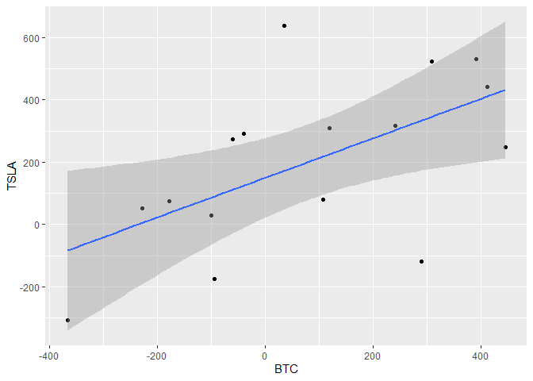<!-- -->

``` r
ggplot(subXS2,aes(y=TSLA,x=BTC))+
  geom_point()+
  geom_smooth(method="lm")
```

    ## `geom_smooth()` using formula = 'y ~ x'

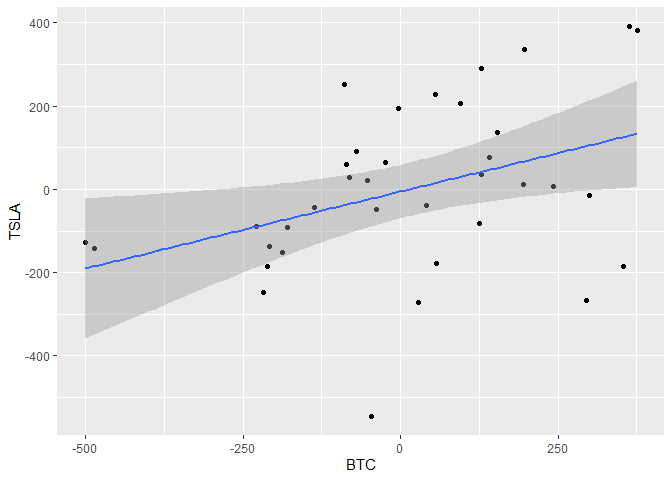<!-- -->
