Sharpe Ratio Comparisons
================
Last updated: 2026-02-21

## Preliminary Work: Install/Load Packages

To try and ensure that this R Notebook will run successfully, we’ll use
the [renv
package](https://cran.r-project.org/web/packages/renv/index.html) to
create a project-specific library of packages. This will allow us to
install the packages that we need for this project without affecting any
other projects that we may be working on. Additionally, the project
library will track the specific versions of the dependency packages so
that any updates to those packages will not break this project.

The code chunk below will first install the renv package if it is not
already installed. Then we will load the package. Next, we’ll use the
`restore()` function to install any packages listed in the renv.lock
file. Once these packages are installed, we can load them into the R
session using the `library()` commands. Below the code chunk, we’ll list
out the packages that will be used in the project demo. And if you run
into any trouble using renv, then you can use the second code chunk
below and that should be an even more reliable approach to install the
required packages.

``` r
# Install renv package if not already installed
if(!"renv" %in% installed.packages()[,"Package"]) install.packages("renv")
# Load renv package
library(renv)
# Use restore() to install any packages listed in the renv.lock file
renv::restore(clean=TRUE, lockfile="../renv.lock")
# Load in the packages
library(fredr)
library(quantmod)
library(xts)
library(tidyr)
library(ggplot2)
library(rmarkdown)
```

- The [fredr package](https://cran.r-project.org/package=fredr) is an R
  package that wraps the FRED API for easy importing of FRED data into
  R.

- The [quantmod package](https://cran.r-project.org/package=quantmod)
  contains tools for importing and analyzing financial data.

- The [xts package](https://cran.r-project.org/package=xts) allows for
  some additional time series functionality.

- The [tidyr package](https://cran.r-project.org/package=tidyr) is used
  to prepare data frames for ggplot2 graphics.

- The [ggplot2 package](https://cran.r-project.org/package=ggplot2)
  includes tools for generating graphics and visuals.

- The [rmarkdown package](https://cran.r-project.org/package=rmarkdown)
  is used to generate this R Notebook.

Since the rmarkdown functionality is built into RStudio, this last one
is automatically loaded when you open RStudio. So no need to use the
`library()` function for it. Another observation to make about the code
chunk above is that it is labeled as `setup`, which is a special name,
which the R Notebook will recognize and automatically run prior to
running any other code chunk. This is useful for loading in packages and
setting up other global options that will be used throughout the
notebook.

Then if you wish to try and update the versions of the various R
packages in the lock file, you can use the `renv::update()` function to
update the packages in the project library. However, it is possible that
these updates could break the code in this notebook. If so, you may need
to adapt the code to work with the updated packages.

My recommendation is to first run through the code using the versions of
the packages in the lock file. Then if you want to try and update the
packages, you can do so and then run through the code again to see if it
still works. If not, you can always revert back to the lock file
versions using the `renv::restore()` function.

If you update the packages and get everything working successfully, then
you can update the lock file using the `renv::snapshot()` function. This
will update the lock file with the versions of the packages that are
currently installed in the project library. Then you can commit the
updated lock file to the repository so that others can use the updated
versions of the packages.

### Alternative Package Installation Code

If you run into any trouble using renv in the code chunk above, then you
can use the code chunk below to install the required packages for this
analysis. This method will first check if you have already installed the
packages. If any are missing, it will then install them. Then it will
load the packages into the R session. A potential flaw in this approach
compared to using renv is that it will simply install the latest
versions of the packages, which could potentially break some of the code
in this notebook if any of the updates aren’t backwards compatible.

As long as you have downloaded the entire project repository, the renv
chunk above will likely be managing the packages. Thus, the `eval=FALSE`
option is used to prevent this chunk from running unless manually
executed. If you only downloaded this one Rmd file, this code chunk
below should take care of installing the packages for you.

``` r
list.of.packages = c("fredr",
                     "quantmod",
                     "xts",
                     "tidyr",
                     "ggplot2",
                     "rmarkdown")
new.packages = list.of.packages[!(list.of.packages %in% installed.packages()[,"Package"])]
if(length(new.packages)) install.packages(new.packages)
library(fredr)
library(quantmod)
library(xts)
library(tidyr)
library(ggplot2)
library(rmarkdown)
```

Set the width of the output boxes to be a bit wider than usual. *This
will help when outputting matrices and other wide outputs.*

``` r
options(width=120)
```

## Set Parameters

This chunk controls the key parameters for the analysis. Edit these
values to change the FRED data series, assets to compare, and sample
length.

``` r
# FRED Series IDs
RF_series = "DGS10"
CPI_series = "CPIAUCSL"

# Yahoo Finance tickers to download and compare (note:cryptos have '-USD' suffixes to distinguish from any stocks with the same ticker)
tickers = c("SPY", "NVDA", "TSLA", "MSTR", "BTC-USD", "ETH-USD", "ADA-USD")

# Number of most recent months to include in final dataset
n_months = 60

# Market and crypto index specifications (for CAPM analysis)
market_index = "SPY"     # The market factor for traditional CAPM
crypto_index = "BTC"     # The crypto market factor for crypto-specific analysis

# Portfolio definitions:
# Each element is a named numeric vector of weights.
# Names must match the *final* return series names from compute_returns
# (e.g., "BTC-USD" → "BTC" after cleaning).
portfolios = list(
  PORT_5050 = c(SPY=0.50, BTC=0.50),
  PORT_9505 = c(SPY=0.95, BTC=0.05)
  # Add more, e.g.:
  # PORT_SPY_NVDA_TSLA = c(SPY = 0.5, NVDA = 0.3, TSLA = 0.2)
)
```

## FRED Data Import

To access the FRED API, you must first create an account and [request an
API key](https://fred.stlouisfed.org/docs/api/api_key.html). If you wish
to run the code and replicate the results, you need to make an account,
generate an API key, save it in a plain text file named “fredapikey”,
and run this command. The `scan` function will load the text, and the
`fredr_set_key` function will set the key for the `fredr` package.

``` r
fredr_set_key(scan("fredapikey", what="character"))
```

Using the `fredr()` function, we will import the risk-free rate and CPI
data. The `Sys.Date()` function uses the computer’s current time to get
the most up-to-date data available. We pull all available monthly data,
then filter to the desired sample period later.

``` r
# Risk-free asset
RFraw = fredr(
  series_id = RF_series,
  frequency = "m"
)

# CPI data (used to calculate inflation rates)
INFraw = fredr(
  series_id = CPI_series,
  frequency = "m"
)
```

We will then create a `xts` time series object, `ALL`, to collect all
the asset returns. This effectively imposes the directed nature of time
into the data frame’s properties and opens the door to additional
functions from the xts package. The second line of code renames the
Treasury yields as `RF`, and the last line removes the extra variables
that are no longer needed.

``` r
# Initialize ALL with the risk-free rate data
ALL = xts(RFraw, order.by=RFraw$date)

# Rename the 'value' column to 'RF' for clarity
colnames(ALL)[colnames(ALL)=="value"] = "RF"

# Remove unnecessary columns
ALL = subset(ALL, select=-c(date, series_id, realtime_start, realtime_end))
```

Before we attach the inflation rate to the `ALL` table, we must first
calculate it from the CPI levels that we downloaded. This will
effectively be the same process that we will follow to convert stock
prices to annualized returns.

First, we do the same three steps as above, which creates the `CPI`
variable in the `INF` data frame. Then we calculate the monthly log
returns (growth rates) by taking the successive difference between the
natural logarithms of the CPI. Lastly, we convert the monthly inflation
numbers to annualized percentages by multiplying by 12 and 100. *There
are some more details on this below in the stock return examples.*

``` r
# Convert CPI data to xts and clean up
INF = xts(INFraw, order.by=INFraw$date)
colnames(INF)[colnames(INF)=="value"] = "CPI"
INF = subset(INF, select=-c(date, series_id, realtime_start, realtime_end))

# Interpolate missing value for Oct 2025 due to govt shutdown
INF$CPI = na.approx(INF$CPI, na.rm=FALSE)

# Calculate monthly inflation rates and annualize
INF$INFmonthly = log(as.numeric(INF$CPI)) - log(as.numeric(lag(INF$CPI)))
INF$INF = INF$INFmonthly*12*100

# Attach the annualized inflation numbers to the ALL data frame
ALL = merge(ALL, INF$INF)
```

## Yahoo Finance Data Import

The quantmod package contains tools for importing both stock and crypto
data from Yahoo! Finance. The `getSymbols()` function is used to import
the data. The first argument is a vector of ticker symbols from the
parameters chunk, and the `src` argument specifies the data source. The
`periodicity="monthly"` requests a monthly series, rather than the
default daily frequency. We pull all available data and will filter to
the desired sample period later.

``` r
getSymbols(tickers,
           src="yahoo",
           periodicity="monthly")
```

    ## [1] "SPY"     "NVDA"    "TSLA"    "MSTR"    "BTC-USD" "ETH-USD" "ADA-USD"

Now let’s compute annualized returns for all assets using a more
efficient approach. We’ll use `lapply()` to iterate through each ticker
and calculate returns, then merge them all into the `ALL` data frame.
The `compute_returns()` function takes a ticker symbol, retrieves the
corresponding data frame created by `getSymbols()`, calculates log
returns, annualizes them, and then cleans up the column names. The
resulting return series is returned as an xts object. After defining
this function, we apply it to all tickers and merge the results into the
`ALL` data frame.

``` r
# Function to compute annualized returns for a given ticker
compute_returns = function(ticker) {
  # getSymbols creates an object with the same name as the ticker
  data_obj = get(ticker)
  adj_col = paste0(ticker, ".Adjusted")
  
  # Compute log returns
  returns = c(NA, diff(log(as.numeric(data_obj[, adj_col]))))
  
  # Annualize returns (monthly → annual, in percent)
  annualized = returns * 12 * 100
  
  # Clean, simplified column name:
  # - remove suffix like '-USD'
  # - strip any remaining non-alphanumeric characters
  base_name = sub("-USD$", "", ticker)  # BTC-USD → BTC
  base_name = gsub("[^A-Za-z0-9]", "", base_name)
  
  result = xts(annualized, order.by = index(data_obj))
  colnames(result) = base_name
  return(result)
}

# Apply to all tickers and merge into ALL
returns_list = lapply(tickers, compute_returns)
ALL = do.call(merge, c(list(ALL), returns_list))
```

## Prepare Final Data

Now that we have all the annualized monthly returns for all the assets,
let’s subset down to the `n_months` most recent full month observations
(as specified in the parameters chunk). The first line takes the
`tail()` of the `ALL` data frame and counts how many of the most recent
observations are incomplete using `complete.cases()`. Then the second
line creates our `FINAL` data frame where we trim off those extra,
incomplete observations. Then the final line trims off anything earlier
than the most recent `n_months` months.

``` r
ntrim = sum(!complete.cases(tail(ALL)))
FINAL = ALL[1:(nrow(ALL)-ntrim),]
FINAL = last(FINAL, n_months)
```

Now let’s calculate the returns for any portfolios that we defined in
the parameters chunk. The code below will loop through each portfolio,
check that all required assets are present in the `FINAL` data frame,
and then compute the weighted return for the portfolio. The resulting
portfolio returns will be added as new columns to the `FINAL` data
frame, and the portfolio names will be added to the list of asset
columns for later use in plotting and statistics.

``` r
# Existing asset columns (excluding RF and INF)
asset_cols = setdiff(colnames(FINAL), c("RF", "INF"))

# Create portfolios from the 'portfolios' list
if (exists("portfolios") && length(portfolios) > 0) {
  for (pname in names(portfolios)) {
    w = portfolios[[pname]]
    
    # Check that all required assets are present
    missing_assets = setdiff(names(w), asset_cols)
    if (length(missing_assets) > 0) {
      warning(
        sprintf(
          "Skipping portfolio '%s': missing assets in FINAL: %s",
          pname,
          paste(missing_assets, collapse = ", ")
        )
      )
      next
    }
    
    # Build portfolio as a weighted sum of existing xts columns
    # Start with a zero xts aligned to FINAL
    port_xts = xts(rep(0, nrow(FINAL)), order.by = index(FINAL))
    for (a in names(w)) {
      port_xts = port_xts + w[a] * FINAL[, a]
    }
    
    colnames(port_xts) = pname
    # Attach portfolio column to FINAL without breaking xts structure
    FINAL = merge(FINAL, port_xts)
    # Track portfolio in asset_cols so it appears in later plots/stats
    asset_cols = c(asset_cols, pname)
  }
}
```

## Examine the Returns Series

### Visualize the Data

We will use the ggplot2 package for graphics. To create comparative
plots efficiently, we’ll reshape the data into long format using `tidyr`
and use `facet_wrap()` to generate all plots at once.

First, let’s plot the risk-free rate and inflation separately since
they’re on a different scale:

``` r
# Convert FINAL xts to a tidy data frame for plotting
plot_data = data.frame(
  Date = index(FINAL),
  coredata(FINAL)
)

# Reshape to long panel format
plot_long = tidyr::pivot_longer(
  plot_data,
  cols = -Date,
  names_to = "Series",
  values_to = "Value"
)

# Preserve original column order from FINAL
series_order = colnames(FINAL)
plot_long$Series = factor(plot_long$Series, levels = series_order)

# Faceted bar chart for all series in FINAL
ggplot(plot_long, aes(x=Date, y=Value)) +
  geom_col(fill="black") +
  facet_wrap(~ Series, scales="free_y", ncol=3) +
  scale_x_date(
    date_breaks="1 year",  # tick every year
    date_labels="%Y"       # show year only
  ) +
  xlab("") +
  ylab("Annualized Growth Rate/Return (%)") +
  ggtitle("Time Series Bar Charts for Each Final Data Series") +
  theme_minimal() +
  theme(axis.text.x = element_text(angle=45, hjust=1))
```

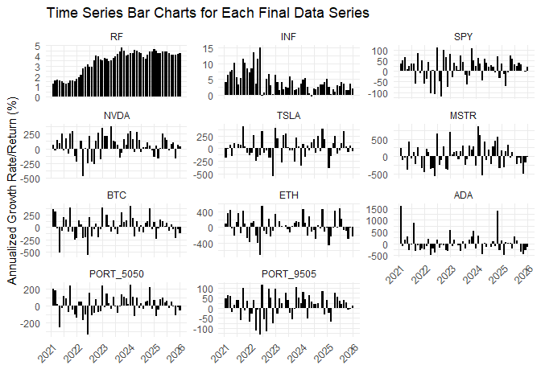<!-- -->

### The Multivariate Return Distribution

Now let’s go beyond just visualizing the individual return series and
look at some statistics for the multivariate return distribution. If we
consider a multivariate normal distribution, we can think of the mean
vector as the expected returns for each asset, and the covariance matrix
as the variance of each asset’s returns along the diagonal, and the
covariances between each pair of assets in the off-diagonal elements.

The `colMeans()` function calculates the average of each column
(i.e. the average return for each asset). *Note: the `round()` function
is applied to reduce the number of decimals when displaying the
calculations in the output.*

``` r
Er = colMeans(FINAL, na.rm=TRUE)
Er |> round(digits=2)
```

    ##        RF       INF       SPY      NVDA      TSLA      MSTR       BTC       ETH       ADA PORT_5050 PORT_9505 
    ##      3.42      4.35     13.89     53.83      9.74     17.72     17.29     12.41     -3.23     15.59     14.06

Now let’s calculate the volatility (standard deviation of returns) for
each of these assets. This is done by simply calculating the standard
deviation `sd()` of each return series (reduced to just one line of code
using the `apply()` function).

``` r
sigma = apply(FINAL, 2, sd, na.rm=TRUE)
sigma |> round(digits=2)
```

    ##        RF       INF       SPY      NVDA      TSLA      MSTR       BTC       ETH       ADA PORT_5050 PORT_9505 
    ##      1.12      3.33     53.05    171.28    201.93    331.63    205.41    258.41    385.41    118.33     56.29

Then beyond the individual asset volatilities, another critical
component of portfolio-level risk is relationship/co-movement between
the assets. This is captured by the correlation matrix, which shows the
pairwise correlations between all assets. The correlation matrix is
derived from the covariance matrix, which captures the raw co-movement
in terms of units of return. The correlation matrix normalizes this by
the individual volatilities to give a standardized measure of how
closely the returns move together, regardless of their individual
scales. This is important for understanding diversification benefits and
how assets interact within a portfolio.

``` r
cov(FINAL) |> round(digits=0)
```

    ##            RF  INF  SPY  NVDA  TSLA   MSTR   BTC   ETH    ADA PORT_5050 PORT_9505
    ## RF          1   -2    2     9    -2     42    14   -19    -47         8         3
    ## INF        -2   11  -17   -10    27   -117  -126  -113    -94       -72       -22
    ## SPY         2  -17 2815  6476  4816   9239  5499  8605   7771      4157      2949
    ## NVDA        9  -10 6476 29338 14485  28180 13990 23346  15871     10233      6852
    ## TSLA       -2   27 4816 14485 40774  27517 16673 24548  20635     10745      5409
    ## MSTR       42 -117 9239 28180 27517 109979 53188 55047  68396     31213     11436
    ## BTC        14 -126 5499 13990 16673  53188 42194 40789  45207     23847      7334
    ## ETH       -19 -113 8605 23346 24548  55047 40789 66775  56048     24697     10214
    ## ADA       -47  -94 7771 15871 20635  68396 45207 56048 148539     26489      9643
    ## PORT_5050   8  -72 4157 10233 10745  31213 23847 24697  26489     14002      5142
    ## PORT_9505   3  -22 2949  6852  5409  11436  7334 10214   9643      5142      3168

The covariance matrix above captures not just the degree of variation in
each asset return series (the diagonal elements are the individual asset
variances), but also the degree to which each pair co-moves with each
other. This is often normalized by individual asset volatilities to give
a correlation matrix:

``` r
Rho = cor(FINAL)
Rho |> round(digits=2)
```

    ##              RF   INF   SPY  NVDA  TSLA  MSTR   BTC   ETH   ADA PORT_5050 PORT_9505
    ## RF         1.00 -0.58  0.04  0.05 -0.01  0.11  0.06 -0.07 -0.11      0.06      0.04
    ## INF       -0.58  1.00 -0.10 -0.02  0.04 -0.11 -0.18 -0.13 -0.07     -0.18     -0.12
    ## SPY        0.04 -0.10  1.00  0.71  0.45  0.53  0.50  0.63  0.38      0.66      0.99
    ## NVDA       0.05 -0.02  0.71  1.00  0.42  0.50  0.40  0.53  0.24      0.50      0.71
    ## TSLA      -0.01  0.04  0.45  0.42  1.00  0.41  0.40  0.47  0.27      0.45      0.48
    ## MSTR       0.11 -0.11  0.53  0.50  0.41  1.00  0.78  0.64  0.54      0.80      0.61
    ## BTC        0.06 -0.18  0.50  0.40  0.40  0.78  1.00  0.77  0.57      0.98      0.63
    ## ETH       -0.07 -0.13  0.63  0.53  0.47  0.64  0.77  1.00  0.56      0.81      0.70
    ## ADA       -0.11 -0.07  0.38  0.24  0.27  0.54  0.57  0.56  1.00      0.58      0.44
    ## PORT_5050  0.06 -0.18  0.66  0.50  0.45  0.80  0.98  0.81  0.58      1.00      0.77
    ## PORT_9505  0.04 -0.12  0.99  0.71  0.48  0.61  0.63  0.70  0.44      0.77      1.00

#### Correlation Heatmap

To better visualize the correlation structure, let’s create a heatmap of
the correlation matrix. We’ll define a helper function to make this
reusable for different return series.

``` r
# Helper function to create correlation heatmap
make_corr_heatmap = function(data, title_text) {
  # Compute correlation matrix
  Rho = cor(data, use="pairwise.complete.obs")
  
  # Get column order from the data
  corr_order = colnames(data)
  
  # Convert correlation matrix to long format for ggplot
  Rho_df = as.data.frame(Rho)
  Rho_df$Var1 = rownames(Rho_df)
  Rho_long = tidyr::pivot_longer(
    Rho_df,
    cols = -Var1,
    names_to = "Var2",
    values_to = "Correlation"
  )
  
  # Preserve ordering on x, reverse on y so the 1's run top-left → bottom-right
  Rho_long$Var1 = factor(Rho_long$Var1, levels = corr_order)
  Rho_long$Var2 = factor(Rho_long$Var2, levels = rev(corr_order))
  
  # Create heatmap
  ggplot(Rho_long, aes(x=Var1, y=Var2, fill=Correlation)) +
    geom_tile(color="white") +
    scale_fill_gradient2(
      low = "blue",
      mid = "white",
      high = "red",
      midpoint = 0,
      limits = c(-1, 1)
    ) +
    geom_text(aes(label=round(Correlation, 2)), size=3) +
    theme_minimal() +
    theme(axis.text.x=element_text(angle=45, hjust=1)) +
    labs(title=title_text, x="", y="") +
    coord_fixed()
}
```

Now we can easily create the heatmap for nominal returns:

``` r
make_corr_heatmap(FINAL, "Correlation Matrix Heatmap of Nominal Returns")
```

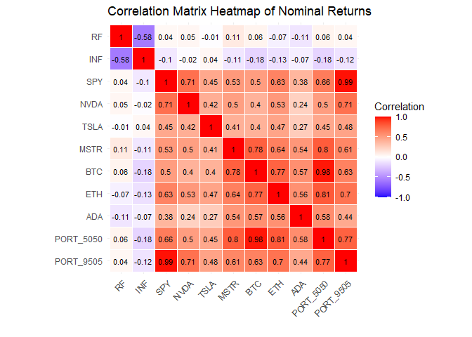<!-- -->

### Real Returns

Before we start calculating Sharpe ratios and betas, we first should
adjust our asset returns for inflation to convert from **nominal
returns** to **real returns** (inflation-adjusted returns). We’ll use an
efficient approach with a for loop to avoid repetitive code.

``` r
# List of asset columns to adjust (excluding INF which we don't need to adjust)
asset_cols_real = setdiff(colnames(FINAL), "INF")

# Create REAL data frame by applying the real return formula to each column
REAL = FINAL[, asset_cols_real]
for (col in asset_cols_real) {
  REAL[, col] = as.numeric(FINAL[, col] - FINAL$INF) / (1 + as.numeric(FINAL$INF / 100))
}
```

If we examine the same summary statistics for the real returns, we can
see how inflation adjustment affects the various metrics. The rest of
the results are qualitatively similar to the nominal returns with
adjustments to the specific numbers due to the inflation correction.

``` r
# Average annual real returns
RealEr = colMeans(REAL, na.rm=TRUE)
RealEr |> round(digits=2)
```

    ##        RF       SPY      NVDA      TSLA      MSTR       BTC       ETH       ADA PORT_5050 PORT_9505 
    ##     -0.78      9.39     47.64      5.04     13.90     13.55      8.75     -6.42     11.47      9.60

``` r
# Annualized volatility of real returns
Realsigma = apply(REAL, 2, sd, na.rm=TRUE)
Realsigma |> round(digits=2)
```

    ##        RF       SPY      NVDA      TSLA      MSTR       BTC       ETH       ADA PORT_5050 PORT_9505 
    ##      3.77     51.11    164.08    194.31    317.57    193.69    245.10    370.85    111.89     54.07

``` r
# Correlation matrix of real returns
RealRho = cor(REAL, use="pairwise.complete.obs")
RealRho |> round(digits=2)
```

    ##              RF  SPY NVDA  TSLA MSTR  BTC  ETH  ADA PORT_5050 PORT_9505
    ## RF         1.00 0.15 0.05 -0.01 0.12 0.17 0.09 0.02      0.18      0.16
    ## SPY        0.15 1.00 0.71  0.45 0.52 0.50 0.62 0.38      0.66      0.99
    ## NVDA       0.05 0.71 1.00  0.42 0.49 0.39 0.52 0.24      0.50      0.71
    ## TSLA      -0.01 0.45 0.42  1.00 0.41 0.39 0.47 0.27      0.44      0.47
    ## MSTR       0.12 0.52 0.49  0.41 1.00 0.78 0.64 0.54      0.80      0.61
    ## BTC        0.17 0.50 0.39  0.39 0.78 1.00 0.76 0.58      0.98      0.63
    ## ETH        0.09 0.62 0.52  0.47 0.64 0.76 1.00 0.57      0.80      0.70
    ## ADA        0.02 0.38 0.24  0.27 0.54 0.58 0.57 1.00      0.59      0.44
    ## PORT_5050  0.18 0.66 0.50  0.44 0.80 0.98 0.80 0.59      1.00      0.77
    ## PORT_9505  0.16 0.99 0.71  0.47 0.61 0.63 0.70 0.44      0.77      1.00

``` r
# Correlation heatmap of real returns
make_corr_heatmap(REAL, "Correlation Matrix Heatmap of Real Returns")
```

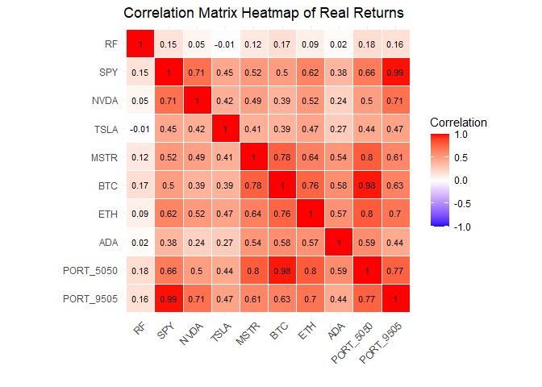<!-- -->

### Excess Returns

The last step before we calculate the Sharpe ratios is converting the
real asset returns into **excess returns** (also known as **risk
premia**). This involves subtracting the risk-free returns from each
asset’s return series.

One way to think about what this does is that the theoretical risk-free
asset should have zero variance. Since our T-bill risk-free asset does
not have zero variance in practice, this adjustment normalizes the
scenario so that the “excess return adjustment” (subtracting the
risk-free rate) forces the risk-free returns to have zero variance, and
thus be more appropriate for modeling. These **real excess returns**
will be the foundation for our Sharpe ratio calculations and CAPM
regressions.

``` r
# List of asset columns (excluding RF)
asset_cols_xs = setdiff(colnames(REAL), "RF")

# Create XS data frame by subtracting risk-free rate from each asset
XS = REAL[, asset_cols_xs]
for(col in asset_cols_xs) {
  XS[, col] = REAL[, col] - REAL$RF
}
```

``` r
# Average annual excess returns
xsEr = colMeans(XS, na.rm=TRUE)
xsEr |> round(digits=2)
```

    ##       SPY      NVDA      TSLA      MSTR       BTC       ETH       ADA PORT_5050 PORT_9505 
    ##     10.17     48.42      5.82     14.68     14.33      9.52     -5.65     12.25     10.38

``` r
# Annualized volatility of excess returns
xssigma = apply(XS, 2, sd, na.rm=TRUE)
xssigma |> round(digits=2)
```

    ##       SPY      NVDA      TSLA      MSTR       BTC       ETH       ADA PORT_5050 PORT_9505 
    ##     50.69    163.91    194.40    317.15    193.10    244.80    370.79    111.28     53.59

``` r
# Correlation matrix of excess returns
xsRho = cor(XS, use="pairwise.complete.obs")
xsRho |> round(digits=2)
```

    ##            SPY NVDA TSLA MSTR  BTC  ETH  ADA PORT_5050 PORT_9505
    ## SPY       1.00 0.71 0.45 0.52 0.49 0.62 0.38      0.66      0.99
    ## NVDA      0.71 1.00 0.42 0.49 0.39 0.52 0.24      0.50      0.71
    ## TSLA      0.45 0.42 1.00 0.41 0.39 0.47 0.27      0.44      0.48
    ## MSTR      0.52 0.49 0.41 1.00 0.78 0.64 0.54      0.80      0.61
    ## BTC       0.49 0.39 0.39 0.78 1.00 0.76 0.58      0.98      0.62
    ## ETH       0.62 0.52 0.47 0.64 0.76 1.00 0.57      0.80      0.70
    ## ADA       0.38 0.24 0.27 0.54 0.58 0.57 1.00      0.59      0.45
    ## PORT_5050 0.66 0.50 0.44 0.80 0.98 0.80 0.59      1.00      0.77
    ## PORT_9505 0.99 0.71 0.48 0.61 0.62 0.70 0.45      0.77      1.00

``` r
# Correlation heatmap of excess returns
make_corr_heatmap(XS, "Correlation Matrix Heatmap of Excess Returns")
```

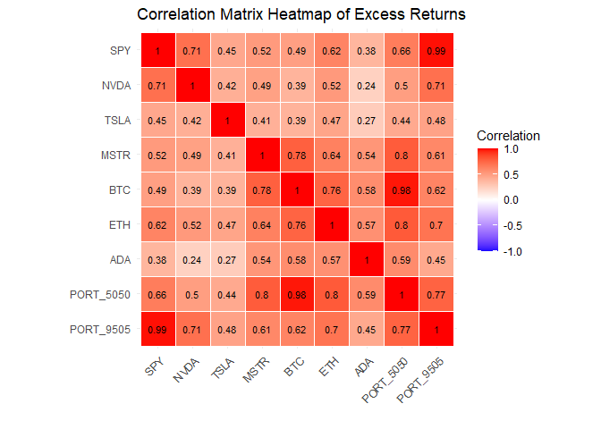<!-- -->

## Sharpe Ratios

The **Sharpe ratio** compares the excess return of a portfolio with its
volatility. For simplicity, we will calculate this for portfolios
invested 100% in each individual asset, followed by the portfolios that
we constructed.

The formula: $Sharpe~Ratio = \dfrac{R_p-R_f}{\sigma_p}$ divides the
average excess return by the standard deviation of the excess returns.

``` r
Sharpes = xsEr / xssigma
Sharpes |> round(digits=2)
```

    ##       SPY      NVDA      TSLA      MSTR       BTC       ETH       ADA PORT_5050 PORT_9505 
    ##      0.20      0.30      0.03      0.05      0.07      0.04     -0.02      0.11      0.19

### Risk-Return Scatter Plot

One of the most intuitive ways to visualize the risk-return tradeoff is
to plot expected returns against volatility. This creates a scatter plot
where assets in the upper-left quadrant (high return, low risk) are most
desirable, while assets in the lower-right quadrant (low return, high
risk) are least desirable.

``` r
# Create data frame for plotting
risk_return_df = data.frame(
  Asset = names(xsEr),
  ExpectedReturn = as.numeric(xsEr),
  Volatility = as.numeric(xssigma),
  SharpeRatio = as.numeric(Sharpes)
)

ggplot(risk_return_df, aes(x = Volatility, y = ExpectedReturn, label = Asset)) +
  geom_point(aes(color = SharpeRatio), size = 4, alpha = 0.9) +
  geom_text(hjust = -0.2, vjust = 0.5, size = 3.5) +
  scale_x_continuous(limits = c(0, NA)) +
  scale_color_gradient2(
    low = "blue",     # negative
    mid = "grey",     # zero
    high = "red",     # positive
    midpoint = 0,
    name = "Sharpe"
  ) +
  labs(
    title = "Risk-Return Tradeoff: Average Excess Return vs. Volatility",
    x = "Volatility (Std. Dev. of Excess Returns)",
    y = "Average Excess Return"
  ) +
  theme_minimal()
```

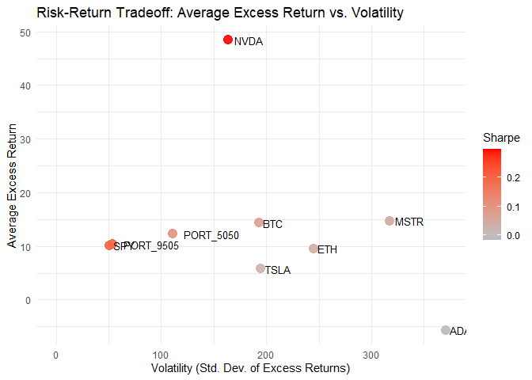<!-- -->

## Betas and the Capital Asset Pricing Model (CAPM)

### Introduction to CAPM

Another important distinction in finance is decomposing risk
(volatility) into two components: **systematic risk** and
**idiosyncratic risk**. In the **Capital Asset Pricing Model (CAPM)**,
systematic risk represents the portion of an asset’s return that can be
explained by movements in the broader market, while idiosyncratic risk
is asset-specific and cannot be diversified away.

The single-factor CAPM posits that an asset’s **real excess return** is
linearly related to the market’s **real excess return**:

$$r_i - r_f = \alpha + \beta \cdot (r_m - r_f) + \epsilon$$

In this equation:

- $r_i$ is the real return for asset $i$
- $r_f$ is the real risk-free rate
- $r_m$ is the real market return (typically proxied by a broad market
  index)
- $\alpha$ (alpha) is the asset’s excess performance beyond what CAPM
  predicts
- $\beta$ (beta) measures the asset’s sensitivity to market movements
- $\epsilon$ represents the regression error (idiosyncratic return)

We estimate $\alpha$ and $\beta$ by regressing the asset’s **real excess
returns** on the market’s **real excess returns**. The interpretation of
beta is as follows:

- **Beta = 1**: The asset moves one-to-one with the market
- **Beta \> 1**: The asset has amplified market sensitivity (higher
  systematic risk)
- **Beta \< 1**: The asset has dampened market sensitivity (lower
  systematic risk)
- **Beta ≈ 0**: The asset is largely uncorrelated with market movements

**Important note on methodology:** Our analysis uses **real excess
returns** (inflation-adjusted returns minus the risk-free rate) for both
the asset and the market. Many online sources (such as Yahoo Finance or
commercial stock screeners) report betas estimated using **nominal
returns** without inflation adjustment. This difference in methodology
may cause our beta estimates to differ slightly from those published
elsewhere. The real return approach is theoretically more rigorous for
long-term analysis, as it accounts for inflation’s impact on purchasing
power.

### Single-Factor CAPM with the Market Index

We will now estimate CAPM regressions for all assets using the market
index (as specified in the parameters) as the single factor. To
streamline the analysis and make it easy to change assets or the market
index, we’ll create a helper function that fits the model, extracts key
statistics, and generates a scatter plot.

``` r
# Helper function to fit CAPM regression and return results
fit_capm = function(asset_name, factor_name, data, plot_color = "darkred") {
  # Build the formula dynamically
  fml = as.formula(paste(asset_name, "~", factor_name))
  
  # Fit the model
  model = lm(fml, data = data)
  
  # Extract key statistics
  beta = coef(model)[2]
  alpha = coef(model)[1]
  r_squared = summary(model)$r.squared
  
  # Create the scatter plot with regression line using tidy evaluation
  plot_obj = ggplot(data, aes(x = .data[[factor_name]], y = .data[[asset_name]])) +
    geom_point(alpha = 0.6, size = 3) +
    geom_smooth(method = "lm", color = plot_color, se = TRUE) +
    labs(
      title = paste(asset_name, "vs.", factor_name, "CAPM Regression"),
      x = paste(factor_name, "Excess Returns"),
      y = paste(asset_name, "Excess Returns")
    ) +
    theme_minimal()
  
  # Return a list with the model, statistics, and plot
  return(list(
    model = model,
    beta = beta,
    alpha = alpha,
    r_squared = r_squared,
    plot = plot_obj
  ))
}
```

Now let’s fit CAPM regressions for all assets in our dataset using the
market index.

``` r
# Get list of all assets that actually exist in XS (excluding the market index itself initially)
capm_assets = intersect(asset_cols, colnames(XS))
capm_assets = setdiff(capm_assets, market_index)

# Add the market index itself (to get beta=1 as expected)
capm_assets = c(market_index, capm_assets)

# Fit CAPM for each asset
capm_results = list()
for (asset in capm_assets) {
  # Only proceed if both asset and market_index are in XS
  if (asset %in% colnames(XS) && market_index %in% colnames(XS)) {
    capm_results[[asset]] = fit_capm(asset, market_index, XS, plot_color = "darkred")
  } else {
    warning(sprintf("Skipping %s: not found in XS", asset))
  }
}
```

    ## Warning in model.matrix.default(mt, mf, contrasts): the response appeared on the right-hand side and was dropped

    ## Warning in model.matrix.default(mt, mf, contrasts): problem with term 1 in model.matrix: no columns are assigned

Let’s examine several key examples in detail to illustrate how to
interpret these CAPM regressions. The regression output provides several
important pieces of information:

- **Beta coefficient**: Measures systematic risk relative to the market
- **Alpha (intercept)**: Represents average outperformance or
  underperformance relative to CAPM predictions
- **R-squared**: Indicates the proportion of return variance explained
  by market movements
- **Statistical significance**: t-statistics and p-values test whether
  coefficients differ from zero

For each asset below, we’ll examine these metrics and discuss their
economic interpretation.

``` r
cat("\n=== NVDA Analysis ===\n")
```

    ## 
    ## === NVDA Analysis ===

``` r
summary(capm_results[["NVDA"]]$model)
```

    ## 
    ## Call:
    ## lm(formula = fml, data = data)
    ## 
    ## Residuals:
    ##     Min      1Q  Median      3Q     Max 
    ## -246.61  -60.73   -1.54   55.98  332.08 
    ## 
    ## Coefficients:
    ##             Estimate Std. Error t value Pr(>|t|)    
    ## (Intercept)  24.9314    15.2398   1.636    0.107    
    ## SPY           2.3096     0.2971   7.772 1.48e-10 ***
    ## ---
    ## Signif. codes:  0 '***' 0.001 '**' 0.01 '*' 0.05 '.' 0.1 ' ' 1
    ## 
    ## Residual standard error: 115.7 on 58 degrees of freedom
    ## Multiple R-squared:  0.5102, Adjusted R-squared:  0.5017 
    ## F-statistic: 60.41 on 1 and 58 DF,  p-value: 1.475e-10

``` r
print(capm_results[["NVDA"]]$plot)
```

    ## `geom_smooth()` using formula = 'y ~ x'

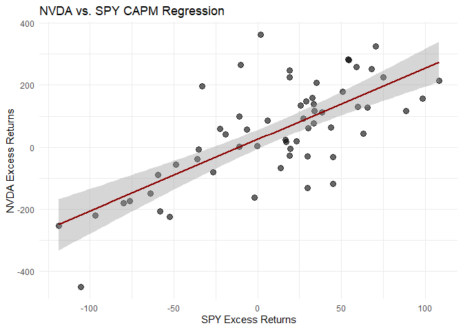<!-- -->

The NVDA results show the relationship between this technology stock and
the broader market. If NVDA is a major component of the market index, we
would expect to see a relatively high beta and R-squared, as the
company’s performance significantly influences the index itself.

``` r
cat("\n=== TSLA Analysis ===\n")
```

    ## 
    ## === TSLA Analysis ===

``` r
summary(capm_results[["TSLA"]]$model)
```

    ## 
    ## Call:
    ## lm(formula = fml, data = data)
    ## 
    ## Residuals:
    ##     Min      1Q  Median      3Q     Max 
    ## -400.72  -90.73   -7.24  135.00  282.14 
    ## 
    ## Coefficients:
    ##             Estimate Std. Error t value Pr(>|t|)    
    ## (Intercept) -11.8587    23.0191  -0.515 0.608395    
    ## SPY           1.7382     0.4488   3.873 0.000276 ***
    ## ---
    ## Signif. codes:  0 '***' 0.001 '**' 0.01 '*' 0.05 '.' 0.1 ' ' 1
    ## 
    ## Residual standard error: 174.8 on 58 degrees of freedom
    ## Multiple R-squared:  0.2055, Adjusted R-squared:  0.1918 
    ## F-statistic:    15 on 1 and 58 DF,  p-value: 0.0002759

``` r
print(capm_results[["TSLA"]]$plot)
```

    ## `geom_smooth()` using formula = 'y ~ x'

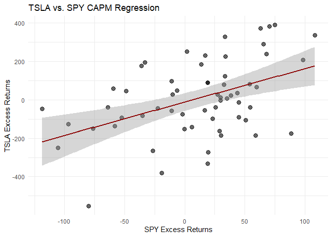<!-- -->

Tesla’s results reflect its position as a high-growth company in the
automotive and energy sectors. The beta estimate reveals how sensitive
Tesla’s returns are to overall market movements, while the alpha
captures any systematic outperformance or underperformance during the
sample period.

``` r
cat("\n=== MSTR Analysis ===\n")
```

    ## 
    ## === MSTR Analysis ===

``` r
summary(capm_results[["MSTR"]]$model)
```

    ## 
    ## Call:
    ## lm(formula = fml, data = data)
    ## 
    ## Residuals:
    ##     Min      1Q  Median      3Q     Max 
    ## -527.35 -214.43  -29.16  171.49  654.17 
    ## 
    ## Coefficients:
    ##             Estimate Std. Error t value Pr(>|t|)    
    ## (Intercept) -18.3842    35.9957  -0.511    0.611    
    ## SPY           3.2511     0.7018   4.632 2.09e-05 ***
    ## ---
    ## Signif. codes:  0 '***' 0.001 '**' 0.01 '*' 0.05 '.' 0.1 ' ' 1
    ## 
    ## Residual standard error: 273.3 on 58 degrees of freedom
    ## Multiple R-squared:  0.2701, Adjusted R-squared:  0.2575 
    ## F-statistic: 21.46 on 1 and 58 DF,  p-value: 2.091e-05

``` r
print(capm_results[["MSTR"]]$plot)
```

    ## `geom_smooth()` using formula = 'y ~ x'

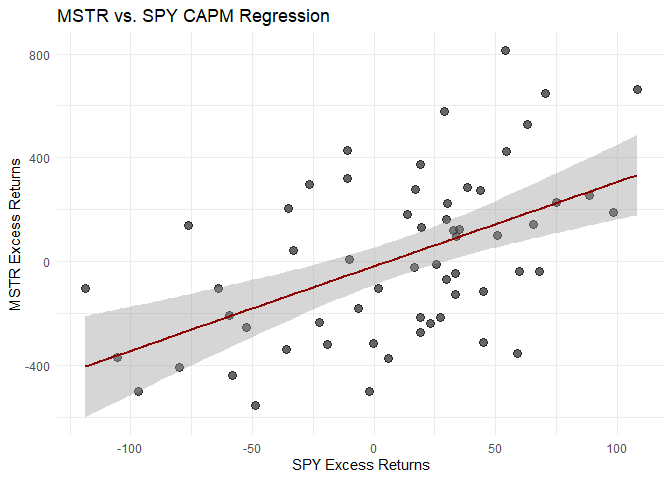<!-- -->

MicroStrategy presents an interesting case due to the company’s
aggressive Bitcoin acquisition strategy. The R-squared statistic is
particularly informative here—it reveals what proportion of MSTR’s
volatility can be explained by traditional market movements versus other
factors (notably, Bitcoin price fluctuations). A lower R-squared
compared to other equities would suggest that non-market factors drive a
significant portion of MSTR’s returns.

Now let’s visualize all the CAPM regressions at once using a faceted
plot. This allows us to compare systematic risk across all assets
simultaneously and identify patterns across asset classes.

``` r
# Prepare data for faceted plot
capm_plot_data = data.frame()
for (asset in capm_assets) {
  temp_df = data.frame(
    Asset = asset,
    MarketReturn = as.numeric(XS[, market_index]),
    AssetReturn = as.numeric(XS[, asset])
  )
  capm_plot_data = rbind(capm_plot_data, temp_df)
}

# Create faceted scatter plot
ggplot(capm_plot_data, aes(x = MarketReturn, y = AssetReturn)) +
  geom_point(alpha = 0.5, size = 2) +
  geom_smooth(method = "lm", color = "darkred", se = FALSE, linewidth = 1) +
  facet_wrap(~ Asset, scales = "free_y", ncol = 3) +
  labs(
    title = paste("CAPM Regressions: All Assets vs.", market_index),
    x = paste(market_index, "Excess Returns (%)"),
    y = "Asset Excess Returns (%)"
  ) +
  theme_minimal() +
  theme(
    strip.text = element_text(size = 10, face = "bold"),
    axis.text.x = element_text(size = 8)
  )
```

    ## `geom_smooth()` using formula = 'y ~ x'

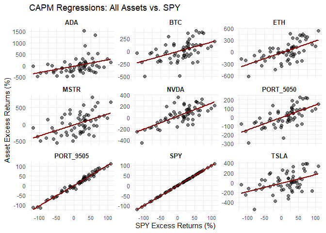<!-- -->

**Model limitations:** The single-factor CAPM is a simplified model with
several important limitations. First, it assumes a linear relationship
between asset and market returns, which may not hold during market
stress or for assets with option-like characteristics. Second, monthly
sampling may miss important intra-month dynamics and return patterns.
Third, cryptocurrencies often violate traditional CAPM assumptions (such
as normally distributed returns and rational investors), making beta
estimates less reliable for these assets. Despite these limitations,
CAPM provides a useful baseline for understanding systematic risk and
serves as a foundation for more sophisticated multi-factor models.

### Crypto Factor Models

As an alternative perspective, we can estimate “crypto-betas” by using a
cryptocurrency (as specified in the parameters) as the market factor
instead of a traditional equity index. This is particularly useful for
understanding how altcoins relate to the dominant cryptocurrency in the
market.

For cryptocurrencies, we expect higher R-squared values when regressed
against the crypto index compared to traditional equity indices, since
crypto assets tend to share common drivers (regulatory news, adoption
trends, technological developments, market sentiment) that are distinct
from traditional equity markets.

``` r
# Define the crypto assets to analyze (those available in XS, excluding the crypto index itself)
all_potential_crypto = c("ETH", "ADA")
crypto_assets = intersect(all_potential_crypto, colnames(XS))
crypto_assets = setdiff(crypto_assets, crypto_index)

# Fit crypto-CAPM for each crypto asset
crypto_capm_results = list()
for (asset in crypto_assets) {
  if (asset %in% colnames(XS) && crypto_index %in% colnames(XS)) {
    crypto_capm_results[[asset]] = fit_capm(asset, crypto_index, XS, plot_color = "darkblue")
  }
}
```

Let’s examine the crypto-beta regressions in detail:

``` r
if ("ETH" %in% names(crypto_capm_results)) {
  cat("\n=== ETH vs", crypto_index, "Analysis ===\n")
  summary(crypto_capm_results[["ETH"]]$model)
  print(crypto_capm_results[["ETH"]]$plot)
}
```

    ## 
    ## === ETH vs BTC Analysis ===

    ## `geom_smooth()` using formula = 'y ~ x'

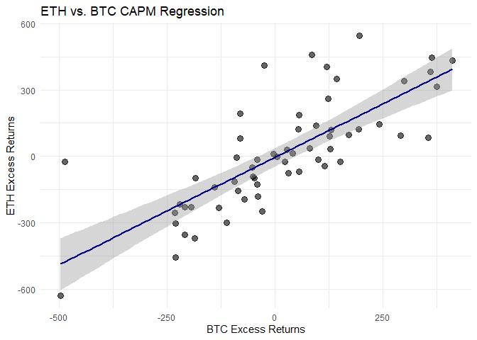<!-- -->

``` r
if ("ADA" %in% names(crypto_capm_results)) {
  cat("\n=== ADA vs", crypto_index, "Analysis ===\n")
  summary(crypto_capm_results[["ADA"]]$model)
  print(crypto_capm_results[["ADA"]]$plot)
}
```

    ## 
    ## === ADA vs BTC Analysis ===

    ## `geom_smooth()` using formula = 'y ~ x'

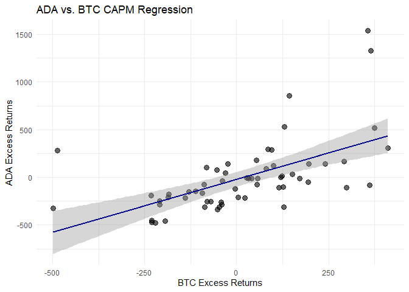<!-- -->

We can also examine the relationship between different altcoins
directly. This provides insight into how these cryptocurrencies co-move
beyond their shared relationship with the dominant cryptocurrency:

``` r
if (all(c("ADA", "ETH") %in% colnames(XS))) {
  ada_eth_result = fit_capm("ADA", "ETH", XS, plot_color = "darkblue")
  cat("\n=== ADA vs ETH Analysis ===\n")
  summary(ada_eth_result$model)
  print(ada_eth_result$plot)
}
```

    ## 
    ## === ADA vs ETH Analysis ===

    ## `geom_smooth()` using formula = 'y ~ x'

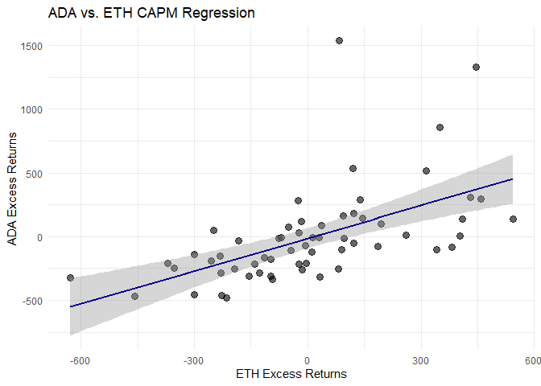<!-- -->

Now let’s create a faceted plot for all crypto relationships:

``` r
# Prepare data for crypto faceted plot
crypto_plot_data = data.frame()

# Crypto index vs altcoins
for (asset in crypto_assets) {
  if (asset %in% colnames(XS) && crypto_index %in% colnames(XS)) {
    temp_df = data.frame(
      Asset = asset,
      FactorReturn = as.numeric(XS[, crypto_index]),
      AssetReturn = as.numeric(XS[, asset]),
      Factor = crypto_index,
      Relationship = paste(asset, "vs.", crypto_index)
    )
    crypto_plot_data = rbind(crypto_plot_data, temp_df)
  }
}

# ETH vs ADA (if both exist)
if (all(c("ETH", "ADA") %in% colnames(XS))) {
  temp_df = data.frame(
    Asset = "ADA",
    FactorReturn = as.numeric(XS[, "ETH"]),
    AssetReturn = as.numeric(XS[, "ADA"]),
    Factor = "ETH",
    Relationship = "ADA vs. ETH"
  )
  crypto_plot_data = rbind(crypto_plot_data, temp_df)
}

# Create faceted scatter plot
if (nrow(crypto_plot_data) > 0) {
  ggplot(crypto_plot_data, aes(x = FactorReturn, y = AssetReturn)) +
    geom_point(alpha = 0.5, size = 2, color = "darkblue") +
    geom_smooth(method = "lm", color = "darkblue", se = FALSE, linewidth = 1) +
    facet_wrap(~ Relationship, scales = "free", ncol = 2) +
    labs(
      title = "Crypto Factor Models: Altcoin Relationships",
      x = "Factor Excess Returns (%)",
      y = "Asset Excess Returns (%)"
    ) +
    theme_minimal() +
    theme(
      strip.text = element_text(size = 10, face = "bold")
    )
}
```

    ## `geom_smooth()` using formula = 'y ~ x'

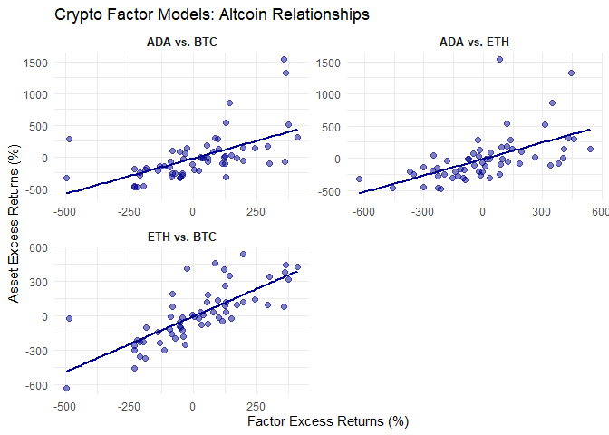<!-- -->

**Interpretation:** Comparing the R-squared values from crypto-to-crypto
regressions with those from crypto-to-equity-index regressions reveals
the extent to which cryptocurrencies represent a distinct asset class.
Higher explanatory power in crypto-to-crypto models confirms that these
assets share common risk factors separate from traditional equity
markets. The magnitude and significance of the beta coefficients
indicate how volatility transmits across the cryptocurrency ecosystem.
Significant alpha coefficients suggest that certain altcoins
systematically outperform or underperform relative to their
beta-adjusted exposure to the dominant cryptocurrency.

### Two-Factor Models for Bitcoin-Exposed Equities

Some equities have direct exposure to cryptocurrencies through corporate
treasury holdings or business operations. For these companies, a
**two-factor model** that includes both a traditional market index and a
cryptocurrency may provide better explanatory power than a single-factor
CAPM.

We’ll examine equities with known cryptocurrency exposure and compare
single-factor models to two-factor models to assess whether
cryptocurrency exposure adds meaningful explanatory power.

``` r
if (all(c("MSTR", crypto_index) %in% colnames(XS))) {
  cat("\n=== MSTR vs", crypto_index, "Single-Factor Analysis ===\n")
  mstr_btc_result = fit_capm("MSTR", crypto_index, XS, plot_color = "purple")
  summary(mstr_btc_result$model)
  print(mstr_btc_result$plot)
}
```

    ## 
    ## === MSTR vs BTC Single-Factor Analysis ===

    ## `geom_smooth()` using formula = 'y ~ x'

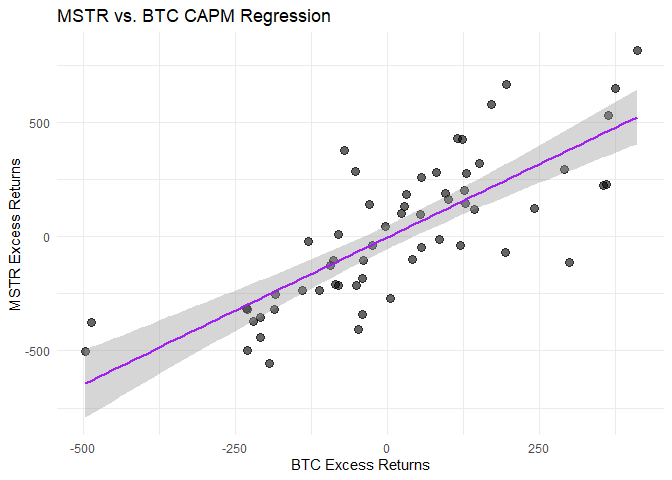<!-- -->

Now let’s fit a two-factor model that includes both the traditional
market index and cryptocurrency exposure:

``` r
if (all(c("MSTR", market_index, crypto_index) %in% colnames(XS))) {
  cat("\n=== MSTR Two-Factor Model ===\n")
  mstr_two_factor = lm(as.formula(paste("MSTR ~", market_index, "+", crypto_index)), data = XS)
  summary(mstr_two_factor)
}
```

    ## 
    ## === MSTR Two-Factor Model ===

    ## 
    ## Call:
    ## lm(formula = as.formula(paste("MSTR ~", market_index, "+", crypto_index)), 
    ##     data = XS)
    ## 
    ## Residuals:
    ##     Min      1Q  Median      3Q     Max 
    ## -492.22 -126.61   -5.38  121.82  447.75 
    ## 
    ## Coefficients:
    ##             Estimate Std. Error t value Pr(>|t|)    
    ## (Intercept) -12.8995    25.7706  -0.501   0.6186    
    ## SPY           1.1081     0.5779   1.918   0.0602 .  
    ## BTC           1.1378     0.1517   7.500 4.67e-10 ***
    ## ---
    ## Signif. codes:  0 '***' 0.001 '**' 0.01 '*' 0.05 '.' 0.1 ' ' 1
    ## 
    ## Residual standard error: 195.6 on 57 degrees of freedom
    ## Multiple R-squared:  0.6326, Adjusted R-squared:  0.6197 
    ## F-statistic: 49.07 on 2 and 57 DF,  p-value: 4.04e-13

**Interpretation for two-factor models:** The key insight comes from
comparing R-squared values across models and examining the statistical
significance of each factor’s coefficient. If both the market index and
cryptocurrency coefficients are statistically significant, this
indicates that the company’s returns are driven by both traditional
market exposure and cryptocurrency exposure. An increase in R-squared
compared to single-factor models quantifies the improvement in
explanatory power. The magnitude of each coefficient reveals the
relative importance of each risk factor—a larger cryptocurrency
coefficient suggests that crypto price movements have a stronger impact
on the company’s returns than traditional market movements.

Similarly, let’s examine other equities with cryptocurrency holdings:

``` r
if (all(c("TSLA", crypto_index) %in% colnames(XS))) {
  cat("\n=== TSLA vs", crypto_index, "Single-Factor Analysis ===\n")
  tsla_btc_result = fit_capm("TSLA", crypto_index, XS, plot_color = "purple")
  summary(tsla_btc_result$model)
  print(tsla_btc_result$plot)
}
```

    ## 
    ## === TSLA vs BTC Single-Factor Analysis ===

    ## `geom_smooth()` using formula = 'y ~ x'

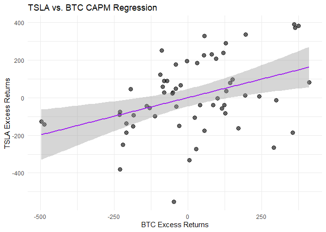<!-- -->

``` r
if (all(c("TSLA", market_index, crypto_index) %in% colnames(XS))) {
  cat("\n=== TSLA Two-Factor Model ===\n")
  tsla_two_factor = lm(as.formula(paste("TSLA ~", market_index, "+", crypto_index)), data = XS)
  summary(tsla_two_factor)
}
```

    ## 
    ## === TSLA Two-Factor Model ===

    ## 
    ## Call:
    ## lm(formula = as.formula(paste("TSLA ~", market_index, "+", crypto_index)), 
    ##     data = XS)
    ## 
    ## Residuals:
    ##     Min      1Q  Median      3Q     Max 
    ## -424.92  -83.75    0.53  130.03  282.44 
    ## 
    ## Coefficients:
    ##             Estimate Std. Error t value Pr(>|t|)  
    ## (Intercept) -10.7798    22.6772  -0.475   0.6363  
    ## SPY           1.3166     0.5085   2.589   0.0122 *
    ## BTC           0.2238     0.1335   1.676   0.0991 .
    ## ---
    ## Signif. codes:  0 '***' 0.001 '**' 0.01 '*' 0.05 '.' 0.1 ' ' 1
    ## 
    ## Residual standard error: 172.1 on 57 degrees of freedom
    ## Multiple R-squared:  0.2428, Adjusted R-squared:  0.2162 
    ## F-statistic: 9.138 on 2 and 57 DF,  p-value: 0.0003611

The results for this analysis depend critically on the size and nature
of the company’s cryptocurrency exposure. For companies where
cryptocurrency holdings represent a large fraction of their balance
sheet or business model, we expect the cryptocurrency factor to be
highly significant. For companies where cryptocurrency holdings are more
modest, the traditional market factor will dominate, and the
cryptocurrency coefficient may not be statistically significant at
conventional levels.

Let’s create a visualization comparing cryptocurrency exposure across
these companies:

``` r
# Prepare data for Bitcoin exposure comparison
btc_exposure_data = data.frame()

# Identify companies with potential crypto exposure
crypto_exposed_companies = c("MSTR", "TSLA")

for (company in crypto_exposed_companies) {
  if (all(c(company, crypto_index) %in% colnames(XS))) {
    temp_df = data.frame(
      Company = company,
      FactorReturn = as.numeric(XS[, crypto_index]),
      CompanyReturn = as.numeric(XS[, company])
    )
    btc_exposure_data = rbind(btc_exposure_data, temp_df)
  }
}

# Create faceted scatter plot
if (nrow(btc_exposure_data) > 0) {
  ggplot(btc_exposure_data, aes(x = FactorReturn, y = CompanyReturn)) +
    geom_point(alpha = 0.5, size = 2, color = "purple") +
    geom_smooth(method = "lm", color = "purple", se = TRUE, linewidth = 1) +
    facet_wrap(~ Company, scales = "free_y") +
    labs(
      title = paste("Cryptocurrency Exposure Analysis:", paste(crypto_exposed_companies, collapse = " and ")),
      x = paste(crypto_index, "Excess Returns (%)"),
      y = "Company Excess Returns (%)"
    ) +
    theme_minimal() +
    theme(
      strip.text = element_text(size = 11, face = "bold")
    )
}
```

    ## `geom_smooth()` using formula = 'y ~ x'

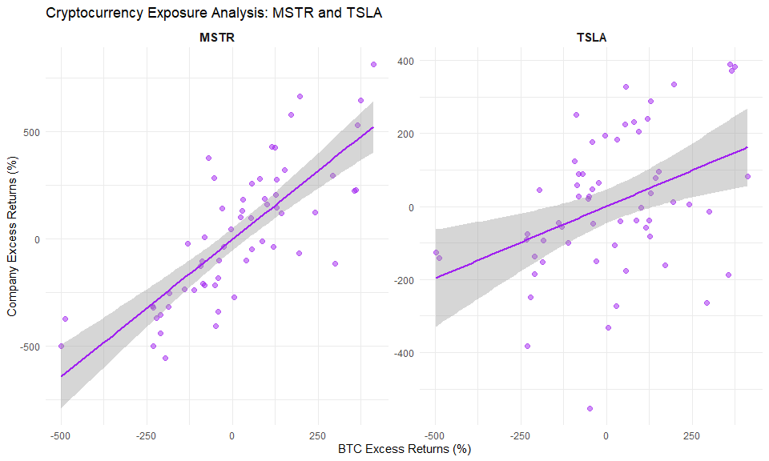<!-- -->

### Extensions and Other Asset Pricing Factors

The single-factor CAPM and simple two-factor models we’ve explored here
represent just the beginning of asset pricing research. Several
important extensions have been developed to address CAPM’s limitations:

**Fama-French Three-Factor Model:** Extends CAPM by adding size (SMB -
Small Minus Big) and value (HML - High Minus Low) factors, which have
been shown to explain cross-sectional variation in stock returns better
than market beta alone.

**Fama-French Five-Factor Model:** Adds profitability (RMW - Robust
Minus Weak) and investment (CMA - Conservative Minus Aggressive) factors
to further improve explanatory power.

**Momentum Factor:** Assets that have performed well (poorly) in the
recent past tend to continue performing well (poorly) in the near
future, suggesting momentum as an additional risk factor.

**Liquidity Factors:** Assets with lower liquidity (higher trading
costs, lower volume) may command a premium to compensate investors for
this additional risk.

**Macro Factors:** Economic variables such as GDP growth, inflation
surprises, term spread, and credit spread can serve as systematic risk
factors in multi-factor models.

For cryptocurrency analysis specifically, researchers have begun
exploring crypto-specific factors such as mining difficulty, network
activity, regulatory sentiment indices, and cross-chain correlation
structures. As the cryptocurrency market matures, we expect more
sophisticated factor models to emerge that better capture the unique
risk characteristics of digital assets.

## Summary Statistics Table

Finally, let’s create a comprehensive summary table that compares all
key metrics across assets. This table integrates the expected returns,
volatility, Sharpe ratios, and CAPM statistics (beta, alpha, and
R-squared) into a single, easy-to-read format.

``` r
# Extract beta, alpha, and R-squared from CAPM results
betas = sapply(capm_assets, function(a) {
  if (a %in% names(capm_results)) {
    capm_results[[a]]$beta
  } else {
    NA
  }
})

alphas = sapply(capm_assets, function(a) {
  if (a %in% names(capm_results)) {
    capm_results[[a]]$alpha
  } else {
    NA
  }
})

r_squared = sapply(capm_assets, function(a) {
  if (a %in% names(capm_results)) {
    capm_results[[a]]$r_squared
  } else {
    NA
  }
})

# Create summary table
summary_table = data.frame(
  Asset = capm_assets,
  Expected_Return = round(as.numeric(xsEr[capm_assets]), 2),
  Volatility = round(as.numeric(xssigma[capm_assets]), 2),
  Sharpe_Ratio = round(as.numeric(Sharpes[capm_assets]), 2),
  Beta = round(betas, 2),
  Alpha = round(alphas, 2),
  R_Squared = round(r_squared, 3)
)

print(summary_table)
```

    ##                   Asset Expected_Return Volatility Sharpe_Ratio Beta  Alpha R_Squared
    ## SPY.NA              SPY           10.17      50.69         0.20   NA  10.17     0.000
    ## NVDA.SPY           NVDA           48.42     163.91         0.30 2.31  24.93     0.510
    ## TSLA.SPY           TSLA            5.82     194.40         0.03 1.74 -11.86     0.205
    ## MSTR.SPY           MSTR           14.68     317.15         0.05 3.25 -18.38     0.270
    ## BTC.SPY             BTC           14.33     193.10         0.07 1.88  -4.82     0.245
    ## ETH.SPY             ETH            9.52     244.80         0.04 3.01 -21.08     0.388
    ## ADA.SPY             ADA           -5.65     370.79        -0.02 2.78 -33.92     0.144
    ## PORT_5050.SPY PORT_5050           12.25     111.28         0.11 1.44  -2.41     0.431
    ## PORT_9505.SPY PORT_9505           10.38      53.59         0.19 1.04  -0.24     0.975

This table provides a comprehensive comparison of:

- **Expected_Return:** Average real excess return (annualized %)
- **Volatility:** Standard deviation of real excess returns (annualized
  %)
- **Sharpe_Ratio:** Risk-adjusted performance (excess return per unit of
  volatility)
- **Beta:** Systematic risk relative to the market index
- **Alpha:** Excess performance beyond what CAPM predicts (annualized %)
- **R_Squared:** Proportion of return variance explained by the market
  factor

Assets with high Sharpe ratios offer better risk-adjusted returns.
Assets with high betas (above 1) are more sensitive to market movements
and carry higher systematic risk, while assets with low betas (below 1)
have dampened sensitivity to the market. Positive alphas suggest
outperformance relative to CAPM predictions, though this may reflect
either genuine skill, exposure to omitted risk factors, or
sample-specific patterns that may not persist. High R-squared values
indicate that market movements explain most of the asset’s return
variation, while low R-squared values suggest that idiosyncratic or
non-market factors dominate the asset’s returns.
